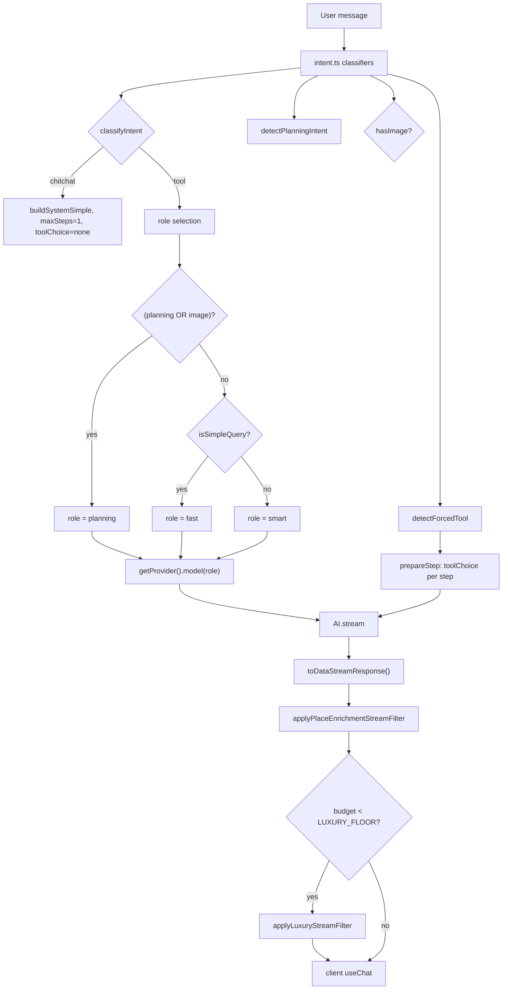
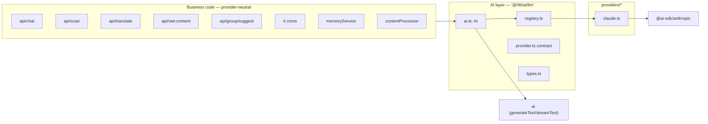

# TappyAI AI Platform — Sprint 1: Architecture Foundation

**Status:** DESIGN ONLY — awaiting Owner approval. No code was changed in this sprint.
**Scope:** Prepare the foundation for Multi-LLM. Zero production behavior change.
**Source of truth:** the code as read on this branch (`fix/web-production-stabilization`). Docs were not trusted; every claim below is grounded in a file:line read during the audit.

> Binding constraint honored: this sprint created **no** abstraction, interface, registry, adapter, router, or refactor. The sections below are a *design* to be reviewed. Nothing here ships until Owner approves.

---

## 0. Executive Summary

The AI platform is **already** structured as a provider-neutral capability layer, and the audit confirms the boundary is clean (only one file imports a vendor SDK). What Sprint 1 delivers is not new code but a **precise map of what exists** plus a **design for the six Multi-LLM primitives** the owner named (Capability Registry, Provider Registry, Provider Policy, AI Router, Telemetry Contract, Config Contract) — with a proof that adopting them is *inert* until a second adapter is both installed and selected.

**One-line finding:** TappyAI is ~70% of the way to Multi-LLM already. The missing 30% is (a) a declared capability matrix per provider, (b) an explicit routing policy with fallback, and (c) a formal telemetry/config contract. None of these require touching a single call site.

---

## 1. Current Architecture (as-built, from code)

### 1.1 Layering

```
Application code (routes, libs, crons, client)
        │  imports ONLY from '@/lib/ai/llm'
        ▼
AI  (capability layer)            src/lib/ai/llm/ai.ts
   generate() · stream() · vision() · providerId() · isConfigured()
        │  getProvider()
        ▼
AIProvider (adapter contract)     src/lib/ai/llm/provider.ts
        │  one adapter per vendor
        ▼
ClaudeProvider                    src/lib/ai/llm/providers/claude.ts
        │  the ONLY file allowed to import a vendor SDK
        ▼
@ai-sdk/anthropic  →  Anthropic API
```

The AI SDK's neutral `LanguageModelV1` interface is the actual seam: `ai.ts` calls `generateText`/`streamText` against whatever `LanguageModelV1` the active adapter returns. That is why a new provider is "resolve roles→models + optional request shaping" and nothing else.

### 1.2 The capability layer — `src/lib/ai/llm/ai.ts`

| Method | AI SDK call | Default role | Forwards |
|---|---|---|---|
| `generate(opts)` | `generateText` | `fast` | maxTokens, temperature |
| `stream(opts)` | `streamText` | `smart` | tools, maxSteps, prepareStep, onFinish, abortSignal, maxTokens |
| `vision(opts)` | `generateText` (image+text message) | `vision` | maxTokens |
| `providerId()` | — | — | telemetry/debug only |
| `isConfigured()` | — | — | credential presence check |

`buildMessages()` normalizes `system`/`prompt`/`messages` into one `CoreMessage[]` and delivers the system prompt as a **leading system message** (not a top-level string) so the provider can attach per-message options — see §1.4.

### 1.3 Provider adapter contract — `src/lib/ai/llm/provider.ts`

```
interface AIProvider {
  id: string
  isConfigured(): boolean
  model(role: ModelRole): LanguageModelV1
  decorateMessages?(messages): CoreMessage[]   // optional, semantically transparent
}
```

### 1.4 Claude adapter — `src/lib/ai/llm/providers/claude.ts`

- Imports `@ai-sdk/anthropic` (the **only** permitted vendor import in the codebase — audit confirmed clean).
- `DEFAULT_MODELS`: **all four roles currently resolve to Claude Haiku 4.5** (`fast: claude-haiku-4-5`, `smart`/`planning`/`vision: claude-haiku-4-5-20251001`). Overridable via `LLM_*_MODEL` env.
- Sets `anthropic-beta: prompt-caching-2024-07-31`.
- `decorateMessages` pins an ephemeral cache breakpoint to the (large, mostly-static) system message. Documented as semantically transparent: identical answers with or without caching.

### 1.5 Registry — `src/lib/ai/llm/registry.ts`

- `getProvider()` — memoized singleton. Reads `LLM_PROVIDER` (default `claude`).
- **Recognizes** `claude | openai | gemini | grok | deepseek`. Only `claude` has an installed adapter; the other four throw an explicit "architecture supports this, adapter not installed" error (a designed extension point, not a bug).
- Per-role overrides from `LLM_FAST_MODEL` / `LLM_SMART_MODEL` / `LLM_PLANNING_MODEL` (falls back to smart) / `LLM_VISION_MODEL`.

---

## 2. Capability Matrix

### 2.1 Semantic roles (the app's vocabulary — it never names a model)

| Role | Intended for | Current model |
|---|---|---|
| `fast` | cheap/low-latency: simple chat turns, extraction, crons | Haiku 4.5 |
| `smart` | standard quality: main chat, content gen, translate | Haiku 4.5 |
| `planning` | multi-step/agentic: itineraries, tool-heavy chats, image chats | Haiku 4.5 |
| `vision` | image understanding: OCR, thumbnail analysis | Haiku 4.5 |

### 2.2 Capabilities each call site actually exercises

| Capability | Used by | Provider requirement it implies |
|---|---|---|
| Plain text generation | 9 `generate` sites | baseline |
| **Streaming** | chat `stream` | provider must support streamed deltas |
| **Multi-step tool calling** | chat `stream` (maxSteps 1–8, `prepareStep` toolChoice) | provider must support tool/function calling **and** forced tool choice |
| **Vision (image input)** | scan (OCR), contentProcessor thumbnail | provider must accept image parts |
| **Temperature control** | viet-content (0.8) | baseline |
| **Prompt caching** | chat (via `decorateMessages`) | provider-specific optimization; optional |
| **Abort/cancel** | chat (`req.signal`) | AI SDK-level; provider-agnostic |

> **Design gap #1:** these capability requirements are currently *implicit*. Every role happens to be served by Claude, which supports all of them. A second provider might not support forced `toolChoice`, or vision, or streaming tool calls. The **Capability Registry** (§6.1) makes each provider *declare* what it supports so the router can refuse or reroute rather than fail at call time.

### 2.3 Full call-site census (14 sites)

| # | Site | Method | Role | Notable options | Purpose |
|---|---|---|---|---|---|
| 1 | `api/chat/route.ts:244` | stream | dynamic `fast`/`smart`/`planning` | tools, maxSteps, prepareStep, onFinish, abortSignal | Main chat + agentic tool loop |
| 2 | `lib/memory/memoryService.ts:191` | generate | fast | maxTokens 500 | Extract long-term memory (from chat onFinish) |
| 3 | `lib/explore/contentProcessor.ts:23` | generate | fast | maxTokens 150 | Caption → hashtags/category |
| 4 | `lib/explore/contentProcessor.ts:43` | generate | fast | maxTokens 200 | Title → caption/metadata |
| 5 | `lib/explore/contentProcessor.ts:61` | vision | fast (override) | image URL, maxTokens 200 | Thumbnail → caption/hashtags |
| 6 | `api/group/[id]/suggest/route.ts:43` | generate | smart | maxTokens 1024 | Group-dining suggestion |
| 7 | `api/viet-content/route.ts:35` | isConfigured | — | — | Guard before generation |
| 8 | `api/viet-content/route.ts:63` | generate | smart | temp 0.8, maxTokens 900 | Social-content generator |
| 9 | `api/scan/route.ts:34` | vision | vision (default) | mimeType, maxTokens 2048 | OCR |
| 10 | `api/translate/route.ts:39` | generate | smart | maxTokens 1024 | Translation |
| 11 | `api/cron/weekly-recap/route.ts:96` | generate | fast | maxTokens 150 | Weekly recap copy |
| 12 | `api/cron/morning-brief/route.ts:151` | generate | fast | maxTokens 150 | Morning brief copy |
| 13 | `api/cron/deal-notifications/route.ts:47` | generate | fast | maxTokens 200 | Deal notification copy |
| 14 | `api/cron/price-check/route.ts:84` | generate | fast | maxTokens 80 | Extract lowest price |

Roles in use: `fast` ×8 (incl. one vision→fast override), `smart` ×3, dynamic ×1, default `vision` ×1.

---

## 3. Provider Matrix

| Provider | Adapter | Status | SDK path (when built) | Notes |
|---|---|---|---|---|
| `claude` | `providers/claude.ts` | **INSTALLED / ACTIVE** | `@ai-sdk/anthropic` | Prompt caching; all roles → Haiku 4.5 |
| `openai` | — | recognized, not installed | `@ai-sdk/openai` | Native tools + vision |
| `gemini` | — | recognized, not installed | `@ai-sdk/google` | Native vision |
| `grok` | — | recognized, not installed | `@ai-sdk/openai` + custom `baseURL` | OpenAI-compatible |
| `deepseek` | — | recognized, not installed | `@ai-sdk/openai` + custom `baseURL` | OpenAI-compatible; **no vision** (capability gap to declare) |

> **Design gap #2:** the matrix's "capability" column (tools? vision? streaming? json?) is not represented anywhere in code. §6.1 fixes that.

---

## 4. Routing Diagram (de-facto router, as-built)

Today "routing" happens in two layers, both **inside the chat route + `intent.ts`** — there is no standalone router object.



**Router inputs today:** `classifyIntent`, `isSimpleQuery`, `detectPlanningIntent`, `detectForcedTool`, `detectLocationIntent`, `isShoppingQuery`, `detectLang`, `hasImage`. **Router output today:** a *role* (never a provider — provider is fixed by env). This is exactly the shape a Multi-LLM router generalizes: `role → (provider, model)` instead of `role → model`.

---

## 5. Dependency Diagram



**Boundary invariant (audited, holds today):** no file outside `src/lib/ai/llm/providers/` imports a vendor SDK; no business file imports `getProvider` (only `ai.ts` does). Supporting libs that shape prompts/streams — `promptBuilder`, `streamEnrichment`, `budget`, `intent`, `contextBuilder`, `tools/*` — are all provider-neutral (they manipulate messages/text/the AI-SDK data-stream protocol, never a vendor response).

---

## 6. Design of the Six Multi-LLM Primitives

Each primitive below is described as a **contract**, not code. Ordering is dependency order.

### 6.1 Capability Registry
**Purpose:** let each provider declare which capabilities it supports, so the router can select or reject a provider deterministically instead of failing mid-call.

**Contract (shape only):** extend the existing `AIProvider` with a declarative `capabilities` descriptor — e.g. `{ streaming, tools, forcedToolChoice, vision, jsonMode, promptCaching }` booleans, plus per-role model presence. This is *additive* to the interface; the Claude adapter declares all-true and nothing else changes.

**Why it belongs here, not in call sites:** call sites already express *capability need* implicitly (a `vision()` call needs vision; a `stream({tools})` call needs tools). The registry lets a future router match need→provider without any call-site edit.

### 6.2 Provider Registry (already exists — formalize)
**Purpose:** the single place a provider is instantiated. **Status: already implemented** in `registry.ts`.

**Design delta for Multi-LLM:** today it returns *one* memoized provider for the whole process. Multi-LLM needs it to resolve *possibly different providers per role/capability*. Design: keep the singleton per-provider-id, but allow the registry to hold a small map `{providerId → provider}` and instantiate lazily on first use. Still no business-code change.

### 6.3 Provider Policy
**Purpose:** the rules that decide, for a given (role, capability, context), *which* provider serves it — including fallback.

**Contract (shape only):** an ordered policy such as:
1. Per-role provider preference (env-driven — see 6.6), default all→`claude`.
2. Capability filter: a provider is eligible only if its Capability Registry entry supports every capability the call needs.
3. Fallback chain: on eligibility miss or a provider error, fall through to the next eligible provider; final fallback = current active provider (so behavior degrades to today's).
4. Cost/latency ordering is **out of scope for Sprint 1** (design placeholder only).

**Default that preserves production:** a single-entry policy `{ '*': ['claude'] }`. With only Claude installed, the policy is a no-op.

### 6.4 AI Router
**Purpose:** generalize the current `role → model` resolution to `(role, capabilities, policy) → (provider, model)`.

**Contract (shape only):** a pure function `resolve(role, requiredCaps) → { provider, model }` that (a) asks the Policy for the ordered candidate providers, (b) filters by the Capability Registry, (c) returns the first match's `model(role)`. `ai.ts` would call the router where it currently calls `getProvider().model(role)` — a *single* internal substitution, invisible to callers.

**The chat route's intent-based role selection (§4) stays exactly where it is.** The router operates *below* role selection; it does not absorb `intent.ts`. This keeps Sprint 1 small and behavior-preserving.

### 6.5 Telemetry Contract
**Purpose:** replace today's ad-hoc `console.log(JSON.stringify({type:'tappyai_*'}))` lines with one declared event schema, so cost/latency/provider can be measured across providers.

**Current telemetry (from code):** `{type:'tappyai_model', model: role}` (chat:230), `{type:'tappyai_usage', promptTokens, completionTokens, totalTokens, elapsedMs, ...}` (chat onFinish), `{type:'tappyai_tool_called', ...}`, `{type:'tappyai_photo_debug', ...}` (verbose, in `tools/common.ts`).

**Contract (shape only):** one event type per call, emitted by the layer (not each caller): `{ event, providerId, role, model, capability[], promptTokens, completionTokens, totalTokens, elapsedMs, finishReason, ok }`. Sprint 1 only *defines* the schema; wiring it is a later sprint. **Note:** the existing `tappyai_photo_debug` logging in `tools/common.ts` predates this and is out of scope, but is flagged in Risk §8 as debug-logging to retire.

### 6.6 Config Contract
**Purpose:** one declared surface for all AI env configuration.

**Current config (from code):** `LLM_PROVIDER` (default `claude`), `LLM_FAST_MODEL`, `LLM_SMART_MODEL`, `LLM_PLANNING_MODEL` (→ smart fallback), `LLM_VISION_MODEL`, `ANTHROPIC_API_KEY`.

**Design delta for Multi-LLM (additive, all optional):**
- Per-role provider selection, e.g. `LLM_PROVIDER_VISION=gemini` (absent → falls back to `LLM_PROVIDER`).
- Per-provider credentials stay per-vendor (`OPENAI_API_KEY`, `GOOGLE_...`), read only inside their adapter.
- **Invariant:** with none of the new vars set, resolution is byte-identical to today.

---

## 7. Migration Plan (phased, each phase independently shippable & reversible)

| Phase | Deliverable | Behavior change | Reversible by |
|---|---|---|---|
| **1 (this doc)** | Architecture design + approval | none | n/a |
| 2 | Add `capabilities` descriptor to `AIProvider`; Claude declares all-true | none (additive field) | delete field |
| 3 | Extend registry to a `{id→provider}` map; add Policy + Router as pure fns; `ai.ts` calls router (default policy `{'*':['claude']}`) | **none** — single-provider policy resolves to Claude exactly as today | revert `ai.ts` one-line substitution |
| 4 | Define Telemetry + Config contracts; emit unified event from the layer | none (adds logs) | remove emit |
| 5 | Install a **second** adapter (e.g. `providers/openai.ts`) behind env; leave policy default = claude | none until env selects it | uninstall adapter |
| 6 | Flip one low-risk role/capability to the second provider in staging; measure via telemetry | **intentional, staged, measured** | env flip back |

**Gate:** phases 2–4 are the "foundation" and are provably inert (§9). Phase 5+ is the actual Multi-LLM enablement and is a *separate* sprint requiring its own approval.

---

## 8. Risk Analysis

| Risk | Severity | Likelihood | Mitigation |
|---|---|---|---|
| A router substitution accidentally changes model resolution | High | Low | Default policy `{'*':['claude']}` + a golden test asserting `resolve(role)` returns the same model id as `getProvider().model(role)` for all 4 roles |
| A second provider silently lacks a capability (e.g. DeepSeek vision, forced toolChoice) | High | Medium | Capability Registry + Policy eligibility filter → refuse/reroute instead of runtime failure |
| Prompt-caching optimization is Claude-specific | Medium | — | Already isolated in `decorateMessages`; other adapters simply omit it (contract allows) |
| Provider error mid-stream leaves chat broken | Medium | Low | Fallback chain ends at the current active provider; streaming errors already return generic `ai_error` (chat:428) |
| Cost blowup from routing to a pricier provider | Medium | Low (Sprint 1 routes nothing new) | Cost ordering explicitly deferred; telemetry lands before any flip |
| Client leakage of provider/model identity | Medium | Low | Already handled — chat returns generic `ai_error`, never `String(e)` (chat:426-431); keep this invariant in the router |
| **Pre-existing:** verbose `tappyai_photo_debug` logging in `tools/common.ts` | Low | — | Out of scope here; retire when Telemetry Contract lands |
| Encoding artifacts in some prompt strings (mojibake in chat route Vietnamese comments/strings) | Low | — | Cosmetic, pre-existing; note for a later cleanup, not a Multi-LLM blocker |

---

## 9. Backward Compatibility Report & Proof of No Behavior Change

**Claim:** adopting Sprint-1 foundation (migration phases 2–4) changes **zero** production behavior.

**Proof by construction:**

1. **Call sites are untouched.** All 14 sites call `AI.generate/stream/vision` with a *role*, never a model or provider. The design adds no required parameter (capabilities are *inferred* from the method + options). ⇒ no diff in business code.

2. **Provider selection is unchanged.** `LLM_PROVIDER` still defaults to `claude`; the new per-role provider env vars default to `LLM_PROVIDER` when unset. With production env unchanged, every role resolves to the Claude adapter. ⇒ same adapter.

3. **Model resolution is unchanged.** The router with default policy `{'*':['claude']}` returns `claudeProvider.model(role)` — identical to today's `getProvider().model(role)`. `DEFAULT_MODELS` (all Haiku 4.5) and the `LLM_*_MODEL` overrides are untouched. ⇒ same model id for every role.

4. **Request shaping is unchanged.** `decorateMessages` (prompt-cache breakpoint on the system message) still runs for the Claude adapter. The system-message-not-string delivery is preserved. ⇒ byte-identical request to Anthropic.

5. **Streaming path is unchanged.** `stream()` still returns the AI SDK result; the chat route still `toDataStreamResponse()` → `applyPlaceEnrichmentStreamFilter` → conditional `applyLuxuryStreamFilter`. The router sits *above* the SDK call and *below* role selection, touching neither. ⇒ same stream, same post-filters, same client contract.

6. **Falsifiable guard:** a single golden test — for each role in `{fast, smart, planning, vision}`, assert the router's resolved model id equals the current `getProvider().model(role)` id, and that `isConfigured()`/`providerId()` are unchanged. If this test passes, points 1–5 are mechanically verified. (Test is part of Phase 3, not written in Sprint 1.)

**Conclusion:** the foundation is *inert*. Behavior changes only at Phase 6, when the Owner deliberately flips a specific role/capability to a second provider in staging — a separate, measured, reversible decision.

---

## 10. What This Sprint Did NOT Do (by instruction)

- No code edited. No abstraction/interface/registry/adapter/router created. No refactor.
- No provider installed. No env changed. No production deploy.
- `intent.ts` routing logic left exactly as-is (the AI Router design deliberately does not absorb it).

---

## 11. Owner Decision Requested

Approve this architecture to proceed to **Migration Phase 2** (add the `capabilities` descriptor — additive, inert), OR request changes. Per the sprint rule: **no code until the Architecture is approved.**

**Status: Waiting Owner Approval.**
