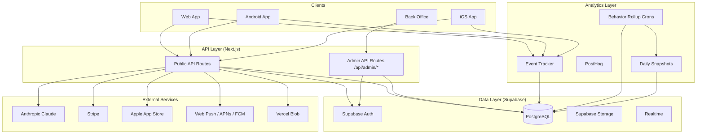
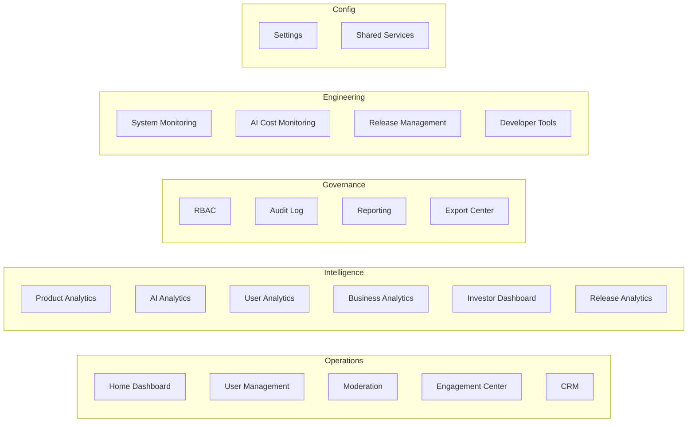
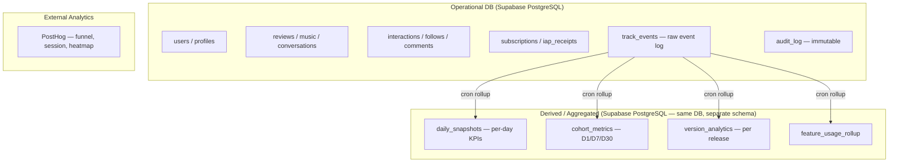
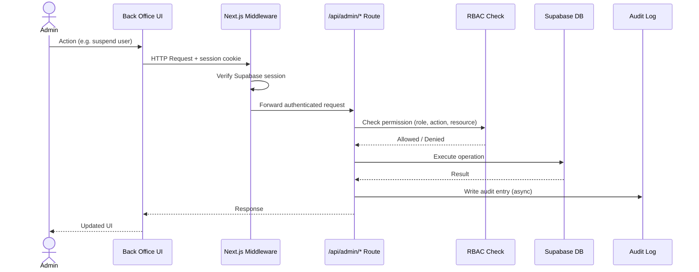

# TappyAI Back Office Platform — Master Architecture

**Version:** 1.0  
**Status:** DRAFT — Awaiting Owner Approval  
**Date:** 2026-07-13

---

## 1. Objective

Define the overall system architecture of the TappyAI Back Office Platform as a unified operational command center that serves all internal stakeholders across the full product lifecycle.

---

## 2. Design Philosophy

| Principle | Application |
|---|---|
| **Backend authoritative** | All business logic in Supabase + API. Back office UI is a read/write client. |
| **Single source of truth** | One analytics pipeline, one event schema, one permission system. |
| **Separation of concerns** | Analytics pipeline ≠ operational DB. Read paths ≠ write paths. |
| **Incremental complexity** | Start with Supabase direct queries. Add dedicated analytics DB only when query complexity demands it. |
| **Security depth** | Auth at every layer: middleware, API, RLS, audit. |

---

## 3. Platform Map



---

## 4. Back Office Module Map



---

## 5. Data Architecture Overview

### Three data layers



**Decision rationale:** A single PostgreSQL instance (Supabase) is sufficient for TappyAI MVP scale. Dedicated analytics DB (ClickHouse, BigQuery) is a future recommendation when daily event volume exceeds 10M rows.

---

## 6. Request Flow — Back Office



---

## 7. URL Structure

All back office routes live under `/admin/`.

```
/admin                          → Home Dashboard
/admin/analytics/product        → Product Analytics
/admin/analytics/ai             → AI Analytics
/admin/analytics/users          → User Analytics
/admin/analytics/business       → Business Analytics
/admin/analytics/releases       → Release Analytics
/admin/investor                 → Investor Dashboard
/admin/reporting                → Reporting
/admin/users                    → User Management
/admin/users/[id]               → User 360
/admin/moderation               → Moderation Queue
/admin/moderation/[id]          → Moderation Case
/admin/engagement               → Engagement Center
/admin/engagement/campaigns     → Campaigns
/admin/engagement/notifications → Push Notifications
/admin/engagement/templates     → Templates
/admin/engagement/segments      → Audience Segments
/admin/crm/[id]                 → CRM — User 360 (detailed)
/admin/audit                    → Audit Log
/admin/rbac                     → Role Management
/admin/monitoring               → System Monitoring
/admin/ai-costs                 → AI Cost Monitoring
/admin/releases                 → Release Management
/admin/settings                 → Settings
/admin/dev-tools                → Developer Tools
/admin/export                   → Export Center
```

---

## 8. API Namespace

All back office API endpoints are under `/api/admin/`.

```
/api/admin/analytics/*      → Analytics data endpoints
/api/admin/users/*          → User management
/api/admin/moderation/*     → Moderation actions
/api/admin/engagement/*     → Campaigns + notifications
/api/admin/reports/*        → Report generation
/api/admin/audit/*          → Audit log queries
/api/admin/rbac/*           → Role + permission management
/api/admin/monitoring/*     → System health
/api/admin/ai-costs/*       → AI cost data
/api/admin/releases/*       → Release management
/api/admin/export/*         → Export generation
/api/admin/settings/*       → Platform settings
```

---

## 9. Technology Decisions

| Component | Technology | Rationale |
|---|---|---|
| Back office framework | Next.js App Router (same repo) | Zero new infra; shared auth + API layer; deploy to same Vercel project |
| UI component library | Shadcn/ui + Tailwind | Already used in main app; consistent design system |
| Charts | Recharts | Lightweight; React-native; already in ecosystem |
| Data tables | TanStack Table | Best-in-class for complex admin tables |
| Analytics store | Supabase PostgreSQL | Sufficient for MVP; avoids new infra dependency |
| External analytics | PostHog (existing) | Already integrated; funnel + session analytics |
| Export | Server-side generation via API routes | Keeps logic in backend |
| Auth | Supabase Auth (existing) | Same session as main app |
| Background jobs | Vercel Cron (existing) | Already used for rollups |

---

## 10. Security Architecture Summary

See `19_Security.md` for full detail.

| Layer | Mechanism |
|---|---|
| Network | HTTPS only; Vercel edge |
| Authentication | Supabase Auth session cookie |
| Route protection | Next.js middleware — redirect unauthenticated |
| Authorization | RBAC check in every `/api/admin/` route handler |
| Database | RLS policies; service role only for admin operations |
| Audit | Every admin action written to `audit_log` |
| Secrets | Vercel environment variables |

---

## 11. Strengths of Existing System

| Strength | Notes |
|---|---|
| Mature auth | Supabase Auth + middleware in production |
| Event tracking foundation | `tracker.ts` + `/api/track` already in use |
| Behavior rollup cron | Pattern exists, can be extended |
| PostHog already integrated | Funnel + session analytics ready |
| Supabase RLS | Security policies already on tables |
| Payment integration | Stripe + Apple IAP live |
| Push notification foundation | Web Push exists; FCM/APNs next |

---

## 12. Technical Debt Relevant to Back Office

| Debt | Impact | Remediation |
|---|---|---|
| `ADMIN_IDS` env var gate | Not scalable; no roles; no audit | Replace with `admin_roles` table + RBAC |
| Single `/admin/analytics` page | No real back office | Full module build |
| `track_events` stores raw JSON | No indexed analytics schema | Add `daily_snapshots` + rollup crons |
| PostHog only for web | Android/iOS not tracked in PostHog | Unified event schema (see `07_Event_Catalog.md`) |
| No audit log | Cannot trace admin actions | `audit_log` table (see `13_Audit_Log.md`) |
| Push notifications — web only | No FCM / APNs | Engagement center architecture (see `09_Notification_Architecture.md`) |

---

## 13. Future Recommendations

> These are NOT in scope for the approved architecture. Documented for future consideration only.

- **Dedicated analytics database** (ClickHouse or BigQuery) when daily events exceed 10M
- **Real-time WebSocket dashboard** (Supabase Realtime) for live concurrent user count
- **AI anomaly detection** for moderation (auto-flag, not auto-ban)
- **Multi-tenant back office** for future agency / white-label scenarios
- **Data warehouse** for long-term historical analysis
- **Customer support integration** (Intercom, Zendesk) via CRM module

---

*End of Master Architecture*
