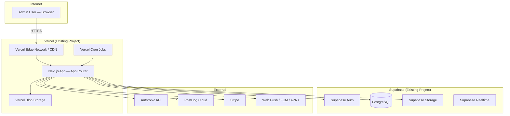
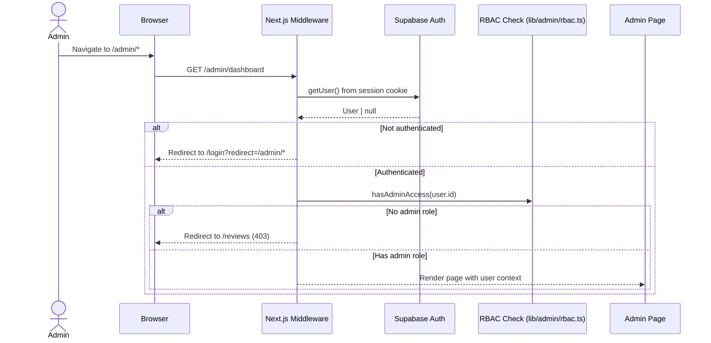
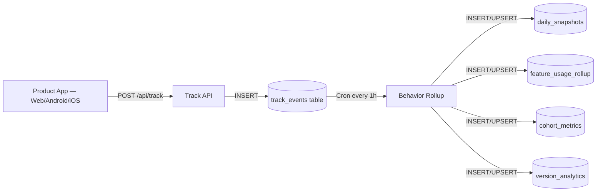
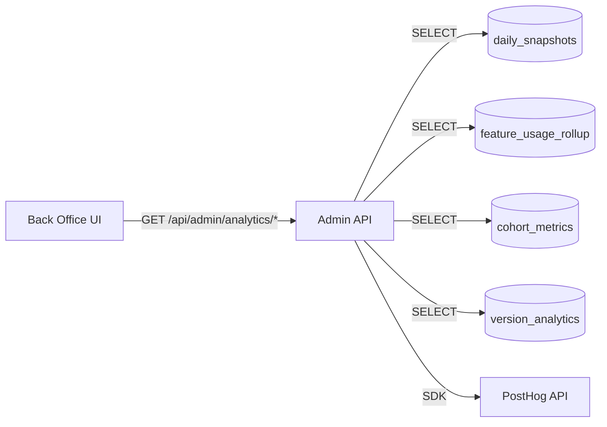

# TappyAI Back Office — System Architecture

**Version:** 1.0  
**Status:** DRAFT — Awaiting Owner Approval  
**Date:** 2026-07-13

---

## 1. Objective

Define the infrastructure, deployment, and system-level architecture of the TappyAI Back Office Platform.

---

## 2. Deployment Architecture



**Decision:** The Back Office is deployed as additional routes within the **same Vercel project and Next.js application**. This is the correct choice because:
- Zero additional infrastructure cost
- Shared authentication with the main app
- Shared Supabase client + RLS
- Shared environment variables
- Single deployment pipeline
- Admin session reuses user session (no separate login)

---

## 3. Application Structure

The back office lives within the existing Next.js project at `src/app/admin/`.

```
src/
├── app/
│   ├── admin/                          ← Back office root
│   │   ├── layout.tsx                  ← Admin shell (nav + auth guard)
│   │   ├── page.tsx                    ← Home dashboard
│   │   ├── analytics/
│   │   │   ├── product/page.tsx
│   │   │   ├── ai/page.tsx
│   │   │   ├── users/page.tsx
│   │   │   ├── business/page.tsx
│   │   │   └── releases/page.tsx
│   │   ├── investor/page.tsx
│   │   ├── reporting/page.tsx
│   │   ├── users/
│   │   │   ├── page.tsx
│   │   │   └── [id]/page.tsx
│   │   ├── moderation/
│   │   │   ├── page.tsx
│   │   │   └── [id]/page.tsx
│   │   ├── engagement/
│   │   │   ├── page.tsx
│   │   │   ├── campaigns/page.tsx
│   │   │   ├── notifications/page.tsx
│   │   │   ├── templates/page.tsx
│   │   │   └── segments/page.tsx
│   │   ├── crm/[id]/page.tsx
│   │   ├── audit/page.tsx
│   │   ├── rbac/page.tsx
│   │   ├── monitoring/page.tsx
│   │   ├── ai-costs/page.tsx
│   │   ├── releases/page.tsx
│   │   ├── settings/page.tsx
│   │   ├── dev-tools/page.tsx
│   │   └── export/page.tsx
│   └── api/
│       └── admin/                      ← Admin API routes
│           ├── analytics/
│           ├── users/
│           ├── moderation/
│           ├── engagement/
│           ├── reports/
│           ├── audit/
│           ├── rbac/
│           ├── monitoring/
│           ├── ai-costs/
│           ├── releases/
│           ├── export/
│           └── settings/
├── components/
│   └── admin/                          ← Back office UI components
│       ├── layout/
│       │   ├── AdminShell.tsx          ← Navigation + sidebar
│       │   ├── AdminNav.tsx
│       │   └── AdminBreadcrumb.tsx
│       ├── charts/                     ← Chart components
│       ├── tables/                     ← Data table components
│       ├── cards/                      ← KPI cards
│       └── shared/                     ← Shared UI primitives
└── lib/
    └── admin/                          ← Back office business logic
        ├── rbac.ts                     ← Permission checking
        ├── audit.ts                    ← Audit log writing
        ├── analytics/                  ← Analytics query helpers
        ├── moderation/
        ├── engagement/
        └── reports/
```

---

## 4. Authentication Flow



**Transition plan from current system:**

Current: `ADMIN_IDS` env var in `src/lib/admin.ts`  
Target: `admin_roles` table in Supabase with role-based permissions  
Migration: Seed existing `ADMIN_IDS` into `admin_roles` table as `super_admin` during implementation

---

## 5. Data Flow Architecture

### 5.1 Write Path (Product App → Analytics)



### 5.2 Read Path (Back Office → Analytics)



---

## 6. Cron Job Architecture

### Existing Crons (to be extended)

| Cron | Schedule | Current Purpose | Back Office Extension |
|---|---|---|---|
| `behavior-rollup` | Hourly | Affinity graph rollup | Extend to populate `daily_snapshots` |
| `morning-brief` | Daily 07:00 VN | User notifications | Add snapshot finalization |
| `weekly-recap` | Weekly | User recap | Add weekly business metrics |

### New Crons Required

| Cron | Schedule | Purpose |
|---|---|---|
| `analytics-snapshot` | Daily 00:05 VN (Asia/Ho_Chi_Minh, UTC+7 = 17:05 UTC) | Finalize yesterday's metrics into `daily_snapshots` |
| `cohort-rollup` | Daily 00:10 UTC | Compute D1/D7/D30 cohort retention |
| `ai-cost-rollup` | Hourly | Aggregate AI token usage + cost |
| `notification-delivery-check` | Every 15min | Update delivery + open rates |

---

## 7. Environment Variables — Back Office Additions

| Variable | Purpose | Secret? |
|---|---|---|
| `BACKOFFICE_ENABLED` | Feature flag to enable/disable back office | No |
| `POSTHOG_SECRET_KEY` | PostHog server-side API key for analytics queries | Yes |
| `REPORT_GENERATION_SECRET` | HMAC key for signed report download URLs | Yes |
| `AUDIT_LOG_RETENTION_DAYS` | How long to retain audit logs (default: 365) | No |

---

## 8. Performance Considerations

| Concern | Strategy |
|---|---|
| Heavy analytics queries | Use pre-computed `daily_snapshots` — never query raw `track_events` for dashboard |
| Large user tables | Paginate all user list endpoints (cursor-based) |
| Report generation | Async generation + signed download URL; not synchronous streaming |
| Dashboard load time | Server-side render KPI cards; client-side hydrate charts |
| Concurrent admin users | Supabase connection pooling (PgBouncer) handles this |

---

## 9. Security Considerations

| Risk | Mitigation |
|---|---|
| Unauthorized admin access | RBAC in middleware + every API route handler |
| Privilege escalation | Only `super_admin` can assign roles; role changes are audit logged |
| Data exfiltration | Export endpoints require explicit permission; rate limited |
| CSRF on admin actions | Supabase session cookies are HttpOnly + SameSite=Lax |
| Sensitive data in logs | PII excluded from `track_events` payload; hashed user IDs in analytics |

---

## 10. Scalability Path

| Phase | Scale | Architecture |
|---|---|---|
| MVP | < 100K MAU | Supabase PostgreSQL for everything |
| Growth | 100K–1M MAU | Add read replicas; separate analytics schema |
| Scale | > 1M MAU | Dedicated analytics DB (ClickHouse/BigQuery); async export pipeline |

The architecture at MVP phase must NOT over-engineer for Growth/Scale phases. Design extension points, not premature infrastructure.

---

*End of System Architecture*
