# TappyAI Back Office — Module Architecture

**Version:** 1.0  
**Status:** DRAFT — Awaiting Owner Approval  
**Date:** 2026-07-13

---

## Module Overview

```mermaid
graph TD
    M01[🏠 Home Dashboard] --> M02[📊 Product Analytics]
    M01 --> M03[🤖 AI Analytics]
    M01 --> M04[👥 User Analytics]
    M01 --> M05[💰 Business Analytics]
    M01 --> M14[🔧 System Monitoring]

    M06[📈 Investor Dashboard] --> M05
    M06 --> M04
    M06 --> M15[💸 AI Cost Monitoring]

    M08[👤 User Management] --> M11[🎯 CRM]
    M08 --> M09[🛡️ Moderation]
    M08 --> M13[📋 Audit Log]

    M10[📢 Engagement Center] --> M13
    M17[📄 Reporting] --> M19[📤 Export Center]
    M12[🔐 RBAC] --> M13
    M16[🚀 Release Analytics] --> M02
    M18[⚙️ Settings] --> M20[🔩 Shared Services]
    M21[🛠️ Developer Tools] --> M14
```

---

## Module 01 — Home Dashboard

**Purpose:** Single-glance operational view of TappyAI health.

**Primary audience:** Founders, Product team

**Key metrics displayed:**
- DAU / WAU / MAU (with trend sparklines)
- New users today vs yesterday vs last week
- Active AI conversations (last 24h)
- Revenue today (Stripe)
- Moderation queue depth
- System health status
- Top feature by usage (last 24h)
- Recent audit events

**Architecture:**
- Server-rendered KPI cards (no loading flicker)
- Charts hydrated client-side with `recharts`
- Data from `daily_snapshots` (pre-computed) — no live queries to raw tables
- Auto-refresh every 5 minutes (optional — configurable in settings)

**Dependencies:** `daily_snapshots`, `track_events` (last 24h only), `moderation_queue`, Stripe webhook data, `system_health_checks`

---

## Module 02 — Product Analytics

**Purpose:** Deep analysis of how users use every product feature.

**Primary audience:** Product team, Founders

**Sections:**

### Feature Usage
- Ranking of all features by: DAU using it, total sessions, avg session time
- Time-series chart per feature
- Feature funnel (e.g. Chat opened → message sent → recommendation clicked)

### Content Analytics
- Reviews uploaded, views, likes, shares, saves
- Top content by engagement
- Content type distribution (video, photo)
- Upload success / failure rate

### Search Analytics
- Top search keywords (food, travel, AI, general)
- Zero-result searches (opportunity signal)
- Search-to-click conversion

### Session Analytics
- App opens per day
- Session duration distribution
- Screens visited per session

**Data sources:** `daily_snapshots`, `feature_usage_rollup`, `track_events` (recent window), PostHog (funnel data via server-side API)

---

## Module 03 — AI Analytics

**Purpose:** Monitor AI product usage, quality, and cost efficiency.

**Primary audience:** Product team, Engineering, Founders

**Sections:**

### Conversation Volume
- Conversations started per day
- Messages per conversation (avg)
- Active conversation threads

### Token Usage
- Total input tokens / output tokens per day
- Cost per day (USD) — calculated from model pricing
- Cost per user per day
- Cost per conversation

### Model Usage
- Distribution by model (e.g. claude-haiku-4-5 vs claude-sonnet-5)
- Tokens per model

### Quality Signals
- User regeneration rate (user hit "regenerate" = likely poor response)
- Thumbs up / thumbs down from `message_feedback`
- Response latency (p50, p95, p99)
- Tool call error rate

### Quota Analytics
- Free tier quota exhausted events
- Conversion to paid after quota (if tracked)
- Anonymous users hitting quota limit

**Data sources:** `ai_usage_log` (new table), `message_feedback`, `anon_chat_usage`, `conversations`, `daily_snapshots`

---

## Module 04 — User Analytics

**Purpose:** Understand user growth, engagement, and retention.

**Primary audience:** Product team, Founders, Investors

**Sections:**

### Growth
- Total registered users (cumulative)
- New users per day / week / month
- Growth rate MoM
- User acquisition (organic vs referral vs social — if tracked)

### Retention
- D1 / D7 / D30 retention cohorts
- Monthly cohort table
- Churn rate

### Engagement
- DAU / WAU / MAU
- Stickiness (DAU/MAU)
- Sessions per user per day
- Average session duration

### Demographics (if collected)
- Language distribution
- Country distribution
- Platform distribution (Web / Android / iOS)
- Device type

### Subscription Funnel
- Free users
- Pro users (Stripe active)
- Conversion rate free → Pro
- Churn rate Pro → Free

**Data sources:** `profiles`, `subscriptions`, `daily_snapshots`, `cohort_metrics`, `track_events`

---

## Module 05 — Business Analytics

**Purpose:** Revenue, subscription, and monetization metrics.

**Primary audience:** Founders, Investors

**Sections:**

### Revenue
- MRR (Monthly Recurring Revenue)
- ARR (Annual Recurring Revenue)
- Revenue per day / week / month
- Revenue by platform (Stripe web vs Apple IAP)

### Subscriptions
- Active subscriptions
- New subscriptions per period
- Churned subscriptions per period
- Net new subscriptions
- Average subscription duration

### Unit Economics
- Revenue per DAU
- Revenue per MAU
- AI cost per paying user
- Gross margin estimate (Revenue − AI Cost)

**Data sources:** `subscriptions`, Stripe API, `iap_receipts`, `ai_usage_log`, `daily_snapshots`

---

## Module 06 — Investor Dashboard

**Purpose:** Curated, executive-grade business metrics for investor reporting.

**Primary audience:** Investors, Board

**Design principle:** Read-only. Cannot be customized by non-super-admin. Fixed layout.

**Sections:**
- MAU / DAU with MoM trend
- MRR with growth rate
- D30 retention
- AI cost efficiency
- User growth trajectory
- Revenue forecast line (simple linear projection)

**Security:** Separate permission required (`investor_dashboard` permission). Never publicly accessible — external sharing is via authenticated **Share Grants** only (secure, expiring, revocable link **plus** password or email OTP + full audit logging), per ADR-009 and Investor Dashboard §5.

**Data sources:** `daily_snapshots`, `cohort_metrics`, `subscriptions`

---

## Module 07 — Reporting

See `08_Reporting_Architecture.md` for full detail.

**Summary:** Generate PDF / Excel / Word / CSV / JSON reports for:
- Founder Reports
- Investor Reports
- Product Reports
- Business Reports
- Moderation Reports
- AI Reports

---

## Module 08 — User Management

See `10_User_Management.md` for full detail.

**Summary:**
- Searchable user list with filters
- User detail view (User 360)
- Admin actions: reset password, suspend, ban, restore, delete
- Subscription management
- Export user list

---

## Module 09 — Content Moderation

See `11_Moderation.md` for full detail.

**Summary:**
- Review / post moderation queue
- Comment moderation
- Music / audio moderation
- User report queue
- AI-assisted flagging (never auto-ban)
- Case management with human decision required

---

## Module 10 — Engagement Center

See `09_Notification_Architecture.md` for full detail.

**Summary:**
- Push notification campaigns (Web + FCM + APNs)
- In-app message campaigns
- Announcements
- Template management
- Audience segmentation
- Scheduling
- Delivery + open + click tracking

---

## Module 11 — CRM (User 360)

See `14_CRM.md` for full detail.

**Summary:**
- Full profile view per user
- Activity timeline
- AI conversation history summary
- Content they created
- Subscription history
- Support notes
- Moderation history
- Admin actions timeline

---

## Module 12 — Audit Log

See `13_Audit_Log.md` for full detail.

**Summary:**
- Immutable record of every admin action
- Searchable by: admin, target user, action type, date
- Cannot be deleted or edited
- Exported for compliance

---

## Module 13 — Role-Based Access Control

See `12_RBAC.md` for full detail.

**Summary:**
- Roles: Super Admin, Admin, Moderator, Analyst
- Resource + action permission matrix
- Role assignment by Super Admin only
- All role changes audit logged

---

## Module 14 — System Monitoring

**Purpose:** Real-time visibility into system health.

**Primary audience:** Engineering

**Sections:**

### API Health
- Endpoint response time (p50, p95, p99)
- Error rate per endpoint
- 5xx / 4xx distribution

### Database
- Query performance
- Connection pool usage
- Slow query log

### Background Jobs
- Cron job success / failure history
- Last run time per cron
- Alert if cron not run within expected window

### Uptime
- /api/health status history
- External service availability (Anthropic, Stripe, Supabase)

**Data sources:** `system_health_log`, Vercel Analytics API, `cron_execution_log`

---

## Module 15 — AI Cost Monitoring

**Purpose:** Track and control Anthropic API spend.

**Primary audience:** Engineering, Founders

**Sections:**
- Cost per day / week / month
- Cost by model
- Cost by feature (chat, scan, translate, etc.)
- Cost per user segment (free vs pro)
- Token efficiency ratio (output quality vs cost)
- Budget alerts (configurable threshold → notification)

**Data sources:** `ai_usage_log`, `daily_snapshots`

---

## Module 16 — Release Management & Version Analytics

See `16_Release_Analytics.md` for full detail.

**Summary:**
- Track app versions across Web / Android / iOS
- Analytics broken down by version
- Adoption curves
- Crash rates by version
- Feature usage by version

---

## Module 17 — Settings

**Purpose:** Back office configuration.

**Sections:**
- Notification settings (VAPID keys, FCM, APNs)
- Free tier limits (AI questions per day)
- Feature flags (enable/disable features without deploy)
- Moderation thresholds
- Report email recipients
- Cron schedules
- Audit log retention

**Security:** Super Admin only. All changes audit logged.

---

## Module 18 — Developer Tools

**Purpose:** Debug and inspect the system without using production DB directly.

**Sections:**
- Live event stream (last 100 `track_events`)
- API endpoint tester
- User impersonation (read-only — see as user, never write as user)
- Feature flag override per user
- Cron manual trigger
- Clear user cache

**Security:** Super Admin + Engineering role only.

---

## Module 19 — Export Center

**Purpose:** Data export for compliance, analysis, and reporting.

**Export types:**
- User list (CSV)
- Event log (CSV / JSON)
- Audit log (CSV / JSON)
- Analytics snapshots (Excel / CSV)
- Full reports (PDF / Word / Excel)

**Architecture:**
- Async generation (not synchronous download for large exports)
- Signed download URL valid for 1 hour
- All exports audit logged (who exported what, when)
- PII exports require explicit permission

**Data sources:** All back office tables

---

## Module 20 — Shared Services

**Purpose:** Utilities shared across all back office modules.

**Services:**
- `AdminAuthService` — verify admin session + RBAC check
- `AuditService` — write audit log entries
- `PaginationService` — cursor-based pagination helpers
- `ExportService` — generate and upload export files
- `NotificationService` — send admin alerts
- `DateRangeService` — standardized date range parsing
- `CacheService` — server-side cache for dashboard queries (1-minute TTL)

---

*End of Module Architecture*
