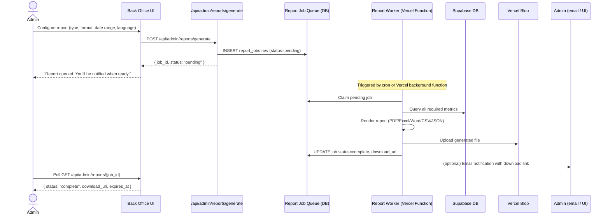

# TappyAI Back Office — Reporting Architecture

**Version:** 1.0  
**Status:** DRAFT — Awaiting Owner Approval  
**Date:** 2026-07-13

---

## 1. Objective

Define the architecture for generating structured reports in PDF, Excel, Word, CSV, and JSON formats for multiple audiences: founders, investors, product team, and operations.

---

## 2. Report Types

| Report | Audience | Key Contents |
|---|---|---|
| **Founder Report** | Founders | Full operational view: DAU/MAU, revenue, AI cost, top features, moderation summary |
| **Investor Report** | Investors / Board | MRR, MAU, D30 retention, growth rate, revenue forecast, unit economics |
| **Product Report** | Product team | Feature usage, funnel analytics, session metrics, search trends |
| **Business Report** | Founders / Finance | Revenue breakdown, subscription cohorts, platform split, AI cost margins |
| **Moderation Report** | Safety team | Reports received, actions taken, ban counts, content removed |
| **AI Report** | Engineering / Founders | Token usage, cost per model, error rate, latency, quota hits |

---

## 3. Report Generation Architecture



**Design decision:** Async generation because:
- PDF/Excel generation for large date ranges can take 5–30 seconds
- Avoids Vercel function timeout limits
- Allows retry on failure
- Download URL (signed Vercel Blob URL) stays valid for 1 hour

---

## 4. Report Jobs Table

```sql
CREATE TYPE report_status AS ENUM ('pending', 'processing', 'complete', 'failed');
CREATE TYPE report_format AS ENUM ('pdf', 'xlsx', 'docx', 'csv', 'json');
CREATE TYPE report_language AS ENUM ('vi', 'en');

CREATE TABLE report_jobs (
    id              UUID PRIMARY KEY DEFAULT gen_random_uuid(),
    requested_by    UUID NOT NULL REFERENCES profiles(id),
    report_type     TEXT NOT NULL,
    format          report_format NOT NULL,
    language        report_language NOT NULL DEFAULT 'vi',
    date_from       DATE NOT NULL,
    date_to         DATE NOT NULL,
    filters         JSONB,
    status          report_status NOT NULL DEFAULT 'pending',
    download_url    TEXT,
    expires_at      TIMESTAMPTZ,
    error_message   TEXT,
    created_at      TIMESTAMPTZ NOT NULL DEFAULT NOW(),
    completed_at    TIMESTAMPTZ
);
```

---

## 5. Report Content Specification

### 5.1 Investor Report

**Purpose:** Concise, board-ready business metrics.

**Contents:**
1. Cover page (TappyAI logo, period, date generated)
2. Executive Summary (3–4 bullet points)
3. User Growth: MAU chart, MoM growth %, total users
4. Retention: D30 cohort table, D7 trend
5. Revenue: MRR, ARR, new subs, churn, net new
6. AI Efficiency: cost/MAU, cost/conversation
7. Platform breakdown (Web / Android / iOS %)
8. Appendix: Raw data table

**Format:** PDF (primary), Excel (data appendix)

**Language:** English default; Vietnamese available

---

### 5.2 Founder Report

**Contents:**
1. Operational scorecard (DAU, MAU, Revenue, AI cost, Moderation)
2. Feature usage ranking
3. User growth funnel
4. AI performance (cost, latency, error rate)
5. Content moderation summary
6. Revenue and subscription health
7. System health (uptime, errors)
8. Top creators and content

**Format:** PDF + Excel

---

### 5.3 Product Report

**Contents:**
1. Feature usage table (users, sessions, time-on-feature)
2. Feature funnel (open → action → retention)
3. Search trends (top 20 queries per category)
4. Session metrics (duration, screens, drop-off)
5. Upload metrics
6. Version adoption

**Format:** Excel (primary — product team wants editable tables)

---

### 5.4 Moderation Report

**Contents:**
1. Reports received by type
2. Actions taken by type
3. Content removed count
4. Users warned / suspended / banned
5. Queue resolution time (avg days)
6. Moderator productivity (actions per moderator)

**Format:** PDF + CSV

---

## 6. Format Implementation

### PDF

**Library:** `@react-pdf/renderer` (React-based PDF generation)

**Why:** Allows component-based layout consistent with TappyAI design system; no external PDF service dependency; runs in Node.js (Vercel function).

**Trade-offs:** Not as feature-rich as dedicated PDF tools (e.g. complex tables); acceptable for reports.

**Approach:** Define PDF templates as React components. Render server-side in Vercel function.

---

### Excel (.xlsx)

**Library:** `xlsx` (SheetJS Community Edition)

**Why:** Pure JavaScript; no external dependency; handles large datasets efficiently.

**Approach:** Programmatic spreadsheet with formatted headers, auto-width columns, charts (SheetJS Pro feature — or skip charts in Excel, keep in PDF).

---

### Word (.docx)

**Library:** `docx` npm package

**Why:** Pure JavaScript; well-maintained; supports headers, tables, styles, TOC.

**Approach:** Structured document with headings, data tables, and branded header/footer.

---

### CSV

**Library:** Built-in string generation (no library needed for simple CSVs)

---

### JSON

**Approach:** Direct serialization of the same data objects used for PDF/Excel — zero extra work.

---

## 7. Language Support

All report templates must support Vietnamese and English.

**Implementation:**
- Report text strings are stored in a report i18n dictionary (similar to main app dictionaries)
- Template receives `language` parameter and renders all labels in correct language
- Data values (numbers, dates, charts) are formatted per locale:
  - Vietnamese: `dd/MM/yyyy` dates, `.` thousands separator
  - English: `MM/dd/yyyy` dates, `,` thousands separator

---

## 8. Report Download Security

- Download URL is a signed Vercel Blob URL, valid for 1 hour
- URL is served through `/api/admin/reports/[job_id]/download` which:
  1. Verifies the requesting user is the one who created the job (or is super_admin)
  2. Verifies the URL has not expired
  3. Redirects to the signed blob URL

This prevents direct URL sharing bypassing auth.

---

## 9. Export Center vs Reporting

| Feature | Reporting | Export Center |
|---|---|---|
| Purpose | Narrative + charts | Raw data |
| Formats | PDF, Excel, Word, CSV, JSON | CSV, JSON, Excel |
| Audience | Business stakeholders | Analysts / Engineering |
| Schedule | Manual | Manual + scheduled |
| Templates | Yes | No (raw data only) |

---

*End of Reporting Architecture*
