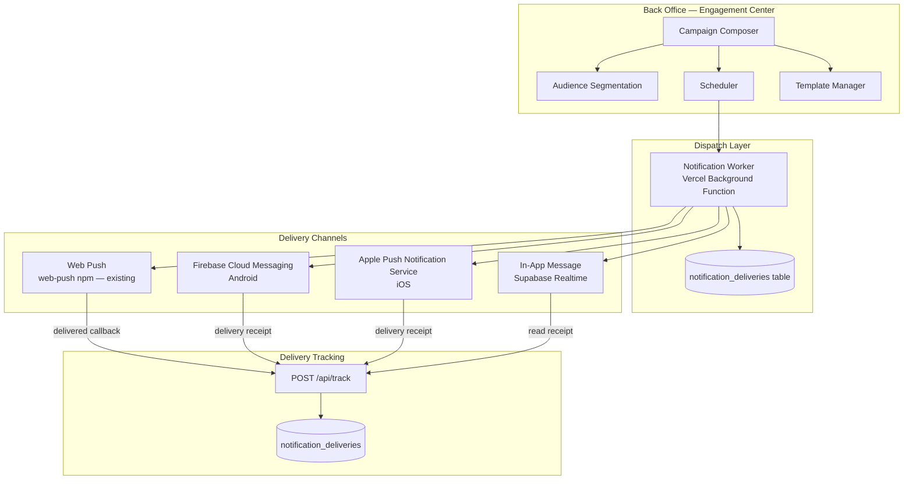
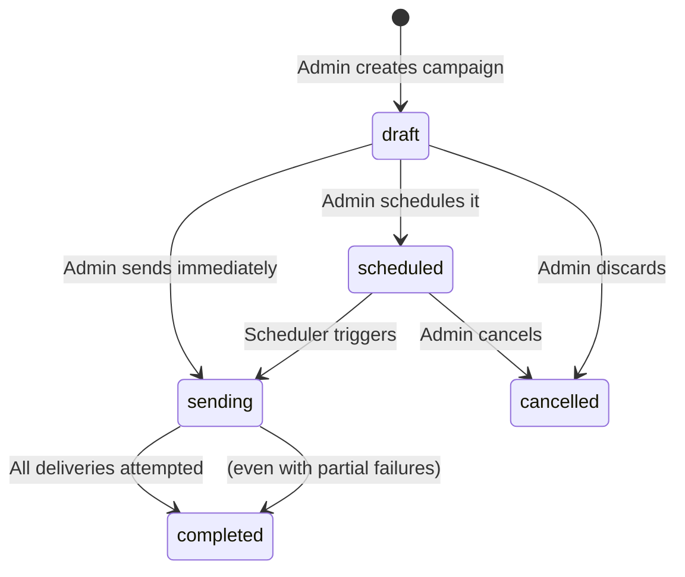

# TappyAI Back Office — Notification & Engagement Center Architecture

**Version:** 1.0  
**Status:** DRAFT — Awaiting Owner Approval  
**Date:** 2026-07-13

---

## 1. Objective

Design the Engagement Center — the back office module for creating, scheduling, sending, and tracking notifications and campaigns across Web Push, FCM (Android), APNs (iOS), and In-App channels.

---

## 2. Channel Architecture



---

## 3. Channel Specifications

### 3.1 Web Push (Existing)

**Status:** Implemented (`src/lib/notifications/send.ts`, `web-push` package)

**Current capability:** Single user send. No campaign support. No delivery tracking.

**Back office additions needed:**
- Batch send to segment
- Delivery status tracking
- Open tracking (via notification click → `/api/track notification_opened`)

**Token storage:** `notification_subscriptions` table (existing)

---

### 3.2 FCM — Firebase Cloud Messaging (Android)

**Status:** Not implemented

**Required:**
1. Firebase project (can be created free)
2. FCM Server Key in Vercel env
3. Android SDK integration — `FirebaseMessaging.getInstance().token`
4. Token stored in `notification_subscriptions` table (add `fcm_token` column)

**Send mechanism:** `firebase-admin` npm package, `messaging().send()`

---

### 3.3 APNs — Apple Push Notification Service (iOS)

**Status:** Not implemented

**Required:**
1. APS_ENVIRONMENT already in env (exists — see App Store readiness sprint)
2. APNs Auth Key (.p8 file) + Key ID + Team ID
3. iOS SDK integration — `UNUserNotificationCenter.requestAuthorization()`
4. Token stored in `notification_subscriptions` table (add `apns_token` column)

**Send mechanism:** `node-apn` npm package or HTTP/2 direct to APNs

---

### 3.4 In-App Messages

**Status:** Not implemented

**Mechanism:** Supabase Realtime channel subscription. When user is active, push message via Realtime. If offline, fall back to push notification.

**Storage:** `in_app_messages` table (new — see below)

---

## 4. `notification_subscriptions` Table Extension

Extend existing table to support multi-channel tokens:

```sql
ALTER TABLE notification_subscriptions
    ADD COLUMN IF NOT EXISTS fcm_token TEXT,
    ADD COLUMN IF NOT EXISTS apns_token TEXT,
    ADD COLUMN IF NOT EXISTS platform TEXT NOT NULL DEFAULT 'web',
    ADD COLUMN IF NOT EXISTS device_model TEXT,
    ADD COLUMN IF NOT EXISTS app_version TEXT,
    ADD COLUMN IF NOT EXISTS is_active BOOLEAN NOT NULL DEFAULT true,
    ADD COLUMN IF NOT EXISTS last_active_at TIMESTAMPTZ;
```

**One row per device per user.** A user may have multiple rows (phone + tablet + web).

---

## 5. Audience Segmentation

Segments are defined as filter queries against the user database.

### Available Filters

| Filter | Type | Example |
|---|---|---|
| `platform` | multi-select | `['web', 'android']` |
| `language` | multi-select | `['vi']` |
| `country` | multi-select | `['VN']` |
| `subscription_tier` | select | `'free'` or `'pro'` |
| `last_active_days` | number | `7` (active in last 7 days) |
| `not_active_days` | number | `14` (inactive for 14+ days) |
| `registered_after` | date | `2026-06-01` |
| `registered_before` | date | `2026-07-01` |
| `has_push_token` | boolean | `true` |
| `feature_used` | text | `'chat'` (used this feature ever) |

### Segment Size Computation

When a segment is created or edited:
1. Server runs a COUNT query against `profiles` JOIN relevant tables using the filter JSON
2. `estimated_size` is stored in `audience_segments`
3. `last_computed` timestamp is recorded

The segment is re-computed before campaign dispatch to get a fresh list.

---

## 6. Campaign Lifecycle



### Sending Process

```
1. Campaign moves to status=sending
2. Worker queries segment to get target user list
3. Worker inserts one notification_deliveries row per user (status=pending)
4. Worker batches deliveries:
   - Web Push: send in batches of 500 (web-push supports this)
   - FCM: send in batches of 500 (FCM supports multi-cast)
   - APNs: send one at a time (HTTP/2 multiplexing handles throughput)
5. On success: UPDATE notification_deliveries status=sent
6. On failure: UPDATE status=failed, store error
7. Campaign total counts updated
8. Campaign status=completed when all batches done
```

---

## 7. Delivery Tracking

| Event | How Tracked |
|---|---|
| Sent | Worker marks `status=sent` after successful API call |
| Delivered | FCM/APNs delivery receipts via webhook (unreliable — best effort) |
| Opened | App sends `notification_received` event on foreground receive |
| Clicked | App sends `notification_clicked` event + marks `notification_deliveries.clicked_at` |

**Note:** Web Push delivery receipts are not supported by most browsers. "Delivered" for web push is estimated as "not bounced".

---

## 8. Templates

Templates are reusable notification blueprints.

### Template Fields

| Field | Description |
|---|---|
| `name` | Internal name (not shown to users) |
| `channel` | push / in_app / announcement |
| `title_vi` / `title_en` | Notification title |
| `body_vi` / `body_en` | Notification body |
| `image_url` | Optional rich notification image |
| `action_url` | Deep link to open on click |

### Variable Substitution

Templates may contain variables:
- `{{user.full_name}}` — replaced with recipient's name
- `{{app.name}}` — TappyAI
- Custom campaign variables

Variable substitution happens at dispatch time per recipient.

---

## 9. In-App Messages Table

```sql
CREATE TABLE in_app_messages (
    id              UUID PRIMARY KEY DEFAULT gen_random_uuid(),
    campaign_id     UUID REFERENCES notification_campaigns(id) ON DELETE CASCADE,
    user_id         UUID NOT NULL REFERENCES profiles(id) ON DELETE CASCADE,
    title           TEXT NOT NULL,
    body            TEXT NOT NULL,
    image_url       TEXT,
    action_url      TEXT,
    is_read         BOOLEAN NOT NULL DEFAULT false,
    read_at         TIMESTAMPTZ,
    dismissed_at    TIMESTAMPTZ,
    created_at      TIMESTAMPTZ NOT NULL DEFAULT NOW()
);

CREATE INDEX idx_inapp_user ON in_app_messages(user_id, is_read, created_at DESC);
```

---

## 10. Announcements

Announcements are broadcast messages shown in-app to ALL users (or a segment) without a notification token requirement.

**Implementation:**
- Insert into `in_app_messages` for all target users
- App queries unread in-app messages on session start
- Show as a banner or modal

**Use case:** "New feature released", "Scheduled maintenance", "Happy Vietnamese New Year" greeting.

---

## 11. Security Considerations

| Risk | Mitigation |
|---|---|
| Unauthorized campaign creation | `admin` role required |
| Sending to wrong audience | Segment preview shows estimated size before send; confirmation dialog required |
| Spam to users | Rate limit: max 1 campaign per day per user (server-enforced) |
| Unsubscribe | Every push notification must honor notification_subscriptions.is_active flag |
| GDPR | User unsubscribe deletes all `notification_subscriptions` rows for that user |

---

*End of Notification Architecture*
