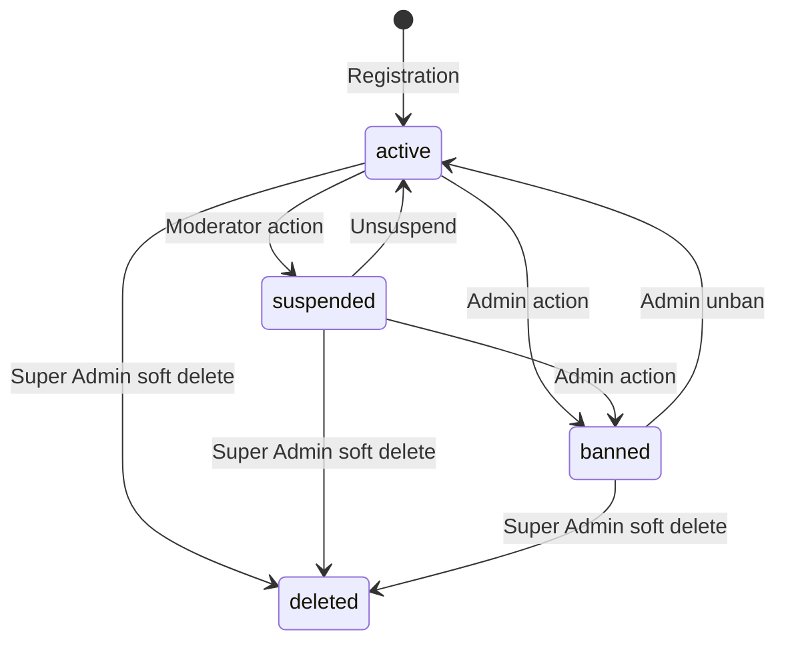

# TappyAI Back Office — User Management

**Version:** 1.0  
**Status:** DRAFT — Awaiting Owner Approval  
**Date:** 2026-07-13

---

## 1. Objective

Design the User Management module — the back office interface for searching, viewing, and administering TappyAI user accounts.

---

## 2. User List View

### Search & Filter

Admins can search and filter users by:

| Filter | Type | Notes |
|---|---|---|
| Text search | Name, email prefix | Partial match; indexed |
| Status | Active / Suspended / Banned / Deleted | From `profiles` flags |
| Subscription | Free / Pro | From `subscriptions` table |
| Platform | Web / Android / iOS | From latest `track_events` platform |
| Registration date | Date range | `profiles.created_at` |
| Last active | Date range | Last event in `track_events` |
| Country | Select | From `preferences` or events |
| Language | Select | From `preferences` |

### Pagination

Cursor-based pagination. Default 50 per page, max 100.

### List Columns

- Avatar (if available)
- Display name
- Email (partially masked: `h***@gmail.com` for `analyst` role — full for `admin+`)
- Registration date
- Last active date
- Subscription tier
- Status badge (Active / Suspended / Banned)
- Platform icons (Web / Android / iOS)
- Quick actions button (suspend / view)

---

## 3. User 360 View

The complete user profile available to admins.

### Sections

#### 3.1 Profile Summary

- Avatar, display name, email (role-gated visibility)
- Registration date, platform, country, language
- Account status (active / suspended / banned)
- Subscription: tier, start date, renewal date, platform
- Admin role (if any)
- Internal notes count

#### 3.2 Activity Timeline

Chronological view of user activity (from `track_events`):
- App opens
- AI conversations
- Content uploads
- Social actions (follows, likes)
- Subscription changes

Paginated. Last 30 days by default.

#### 3.3 AI Usage Summary

- Total conversations (all time, last 30 days)
- Total messages sent
- Total AI cost attributed to this user
- Quota hits count
- Most used AI features

Data source: `ai_usage_log` + `conversations`

#### 3.4 Content

- Reviews uploaded (count + list of recent 10)
- Music saved count
- Comments posted count

#### 3.5 Social

- Followers / Following count
- Groups joined

#### 3.6 Subscription History

- Full subscription event timeline (from `subscriptions` + Stripe)
- Payment history (if Stripe)
- IAP receipts (if Apple)

#### 3.7 Moderation History

- Reports submitted by this user
- Reports received against this user's content
- Moderation actions taken against this user (warnings, suspensions)

#### 3.8 Admin Notes

- Chronological internal notes from `user_notes`
- Pinned notes shown at top
- Add new note inline

#### 3.9 Admin Actions Panel

Contextual action buttons (permission-gated):

| Action | Required Role | Description |
|---|---|---|
| Send password reset | `admin` | Triggers Supabase password reset email |
| Suspend (with duration) | `moderator` | Temporary suspension |
| Unsuspend | `moderator` | Remove suspension |
| Ban | `admin` | Permanent ban |
| Unban | `admin` | Restore from ban |
| Delete account (soft) | `super_admin` | Anonymize PII |
| Grant admin role | `super_admin` | Assign back office role |
| Revoke admin role | `super_admin` | Remove back office role |
| Force logout all sessions | `admin` | Revoke all Supabase sessions |
| Add internal note | `moderator` | CRM note |
| Export user data | `admin` | GDPR data export |

---

## 4. Account Status Management

### Status State Machine

### Suspension

- Sets `profiles.is_suspended = true`
- Sets `profiles.suspended_until` (if time-limited)
- User can still access app but:
  - Cannot post content
  - Cannot comment
  - Cannot use AI (show "account suspended" message)
  - Can browse read-only
- Cron job: auto-unsuspend when `suspended_until` passes

### Ban

- Sets `profiles.is_banned = true`
- Revokes ALL active Supabase sessions for the user
- User cannot log in — sees "account permanently suspended" message
- Content remains (hidden from feed) unless moderator separately hides it

### Soft Delete

- Anonymizes all PII in `profiles`:
  - `full_name` → `Deleted User`
  - `email` → `deleted_{uuid}@deleted.tappyai.com`
  - `avatar_url` → null
  - `bio` → null
  - Phone/external IDs → null
- Does NOT delete database rows (maintains referential integrity)
- `is_banned = true` (prevents login if somehow re-encountered)
- Content is hidden (`is_hidden = true` on all their reviews)
- Deletes from `notification_subscriptions` (GDPR)
- Deletes from `user_memory` (GDPR)

---

## 5. GDPR / Data Export

When admin triggers "Export User Data":
1. Collect: profile, conversations, reviews, interactions, preferences, ai_usage_log, subscriptions
2. Generate JSON zip file
3. Signed download URL valid 1 hour
4. Audit log entry

This is also the response to GDPR Subject Access Requests.

---

## 6. Email Masking Policy

| Role | Email Visibility |
|---|---|
| `analyst` | `h***@gmail.com` (masked) |
| `moderator` | `h***@gmail.com` (masked) |
| `admin` | Full email |
| `super_admin` | Full email |

PII access requires at minimum `admin` role. This is enforced in the API query layer, not just UI.

---

## 7. Bulk Actions

Available on user list (with checkboxes):

| Action | Required Role |
|---|---|
| Export selected users (CSV) | `admin` |
| Send push notification to selected | `admin` |
| Suspend selected | `admin` (not moderator for bulk) |
| Ban selected | `super_admin` |

All bulk actions require a confirmation dialog with count.

All bulk actions are audit logged as a single bulk action entry with the list of affected user IDs.

---

*End of User Management*
