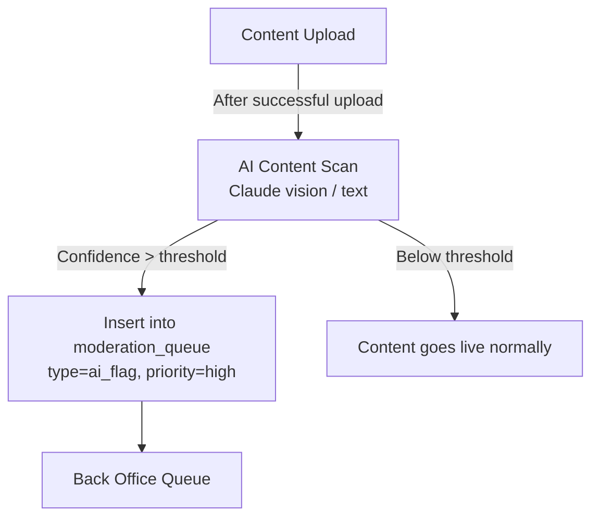

# TappyAI Back Office — Content Moderation Architecture

**Version:** 1.0  
**Status:** DRAFT — Awaiting Owner Approval  
**Date:** 2026-07-13

---

## 1. Objective

Design a complete content moderation system that protects TappyAI users and the platform from harmful content while respecting due process and requiring human decision-making for all significant actions.

---

## 2. Core Principle

> **AI assists. Humans decide.**

AI-assisted flagging will identify potentially harmful content and route it to the moderation queue.

AI will **never** automatically ban users, hide content, or take consequential action without a human moderator approving the action.

---

## 3. Content Types Subject to Moderation

| Content Type | Source | Moderation Trigger |
|---|---|---|
| Video reviews | User upload | User report or AI flag |
| Review comments | User post | User report or AI flag |
| User profile | User-set bio/name | User report only |
| Music tracks | User upload | User report or AI flag |
| Profile avatar | User upload | User report only |
| AI conversations | System-generated | N/A (AI output, not UGC) |

---

## 4. Report Flow

### 4.1 User Reports (from Product App)

```mermaid
graph TD
    USER[Product App User] -->|Tap "Report"| REPORT_UI[Report Form]
    REPORT_UI -->|POST /api/reviews/{id}/report| REPORT_API[Report API]
    REPORT_API -->|INSERT| MOD_QUEUE[(moderation_queue)]
    MOD_QUEUE -->|Auto-priority if 3+ reports| HIGH_PRIORITY[Elevated Priority]
    MOD_QUEUE --> BACK_OFFICE[Back Office Moderation Queue]
```

### 4.2 AI-Assisted Flagging



**AI scan scope:**
- Video review titles and descriptions (text analysis)
- Review thumbnails (image safety — Claude vision)
- Music track titles + descriptions
- User bio text

**AI does NOT automatically hide or act on content.** It only creates a queue entry with its confidence score as context for the human moderator.

---

## 5. Moderation Queue

### Queue Display

The moderation queue shows:

| Column | Description |
|---|---|
| Priority | 🔴 Urgent / 🟡 High / ⚪ Normal |
| Type | Report type badge |
| Content preview | Thumbnail/text snippet |
| Reporter | Who reported (anonymous option) |
| Reason | Report reason |
| Age | Time in queue |
| Status | Pending / In Review / Resolved |
| Assigned | Moderator assigned to this case |

### Sorting & Filters

- Default: Priority DESC, then Age ASC (oldest urgent first)
- Filter by: type, status, assigned moderator, date range

### Queue Escalation Rules

| Trigger | Action |
|---|---|
| 3+ reports on same content within 24h | Elevate to `priority=2` (high) |
| 10+ reports on same content | Elevate to `priority=3` (urgent) + notify admin |
| AI flag + 1 user report | Elevate to `priority=2` (high) |
| AI flag with score > 0.9 | `priority=3` (urgent) |

---

## 6. Case Management

### Case Detail View

When a moderator opens a moderation case:

1. **Content panel** — Full preview of reported content (video player, text, image)
2. **Reporter info** — Who reported, how many reports, reasons
3. **AI flag info** (if applicable) — AI confidence score, flagged categories
4. **Creator info** — Username, account age, prior violations, subscriber count
5. **Prior moderation** — History of actions on this user / content
6. **Decision panel** — Action buttons with required reason field

### Decision Panel Actions

| Action | Effect | Required Role |
|---|---|---|
| Dismiss (no action) | Closes case as invalid | `moderator` |
| Issue warning | Records warning in user's history | `moderator` |
| Hide content | Sets `reviews.is_hidden = true` | `moderator` |
| Restore content | Sets `reviews.is_hidden = false` | `moderator` |
| Delete content | Permanent deletion | `admin` |
| Suspend user (24h/72h/7d/30d) | Temporary account suspension | `moderator` |
| Ban user (permanent) | Permanent account ban | `admin` |
| Escalate to admin | Re-queue with higher priority + flag | `moderator` |

**All decisions require a written reason (minimum 20 characters).** This feeds the audit log and protects the platform from arbitrary moderation.

---

## 7. Warning System

When a user receives a warning:
1. A record is created in `moderation_actions` (action=`warn`)
2. The user receives an in-app notification explaining the warning
3. The warning is visible in the user's moderation history

**Escalation policy (recommendation — owner to approve):**
- 1 warning → recorded
- 2 warnings in 30 days → 24h suspension (automatic suggestion to moderator, not automatic action)
- 3 warnings in 30 days → 7d suspension (moderator must approve)

---

## 8. Suspension Notification

When a user is suspended:
1. All their sessions are revoked (cannot access app)
2. They receive an email (via Supabase Auth) explaining the suspension and duration
3. On next login attempt, they see the suspension message and end date

---

## 9. Appeals Process (Future Recommendation)

> NOT in scope for MVP. Documented for future consideration.

A user appeals mechanism where:
- Banned/suspended users can submit an appeal via a simple form (unauthenticated)
- Appeals are routed to `moderation_queue` with `type=appeal`
- Admin reviews and can reverse the decision

---

## 10. Moderation Analytics

Moderation report (see `08_Reporting_Architecture.md`) includes:

- Reports received per day (by type)
- Average queue resolution time
- Actions taken (warn/hide/delete/suspend/ban counts)
- False positive rate (cases dismissed)
- Moderator performance (actions per moderator per day)
- Repeat offenders (users with 3+ actions)

---

## 11. AI Scan Implementation Note

The AI scanning uses Claude (existing Anthropic integration) with a structured prompt:

```
You are a content safety AI for TappyAI, a Vietnamese social platform.
Analyze the following content and return a JSON safety assessment.

Content: [review title + description / image]

Return:
{
  "safe": true/false,
  "confidence": 0.0-1.0,
  "categories": ["violence", "nudity", "hate_speech", "spam", "misinformation"],
  "explanation": "..."
}
```

This runs **after** upload, not before. Content goes live immediately; flagged content enters the queue for human review. This keeps upload latency minimal.

**Exception:** If AI confidence > 0.95, content may be temporarily hidden pending review. This is the ONLY case of automated action, and it is temporary (content is restored if moderator dismisses).

---

*End of Moderation Architecture*
