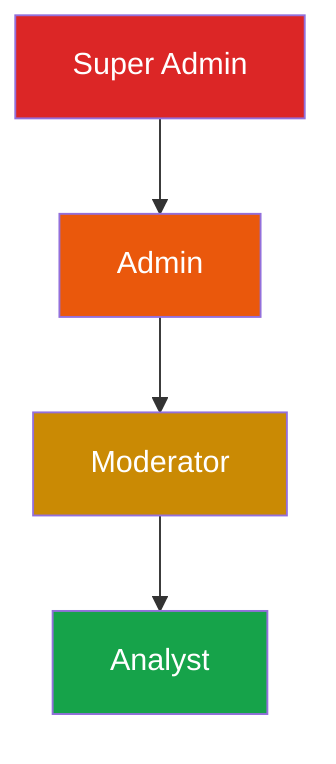

# TappyAI Back Office — Role-Based Access Control

**Version:** 1.0  
**Status:** DRAFT — Awaiting Owner Approval  
**Date:** 2026-07-13

---

## 1. Objective

Design production-grade RBAC that is secure, auditable, and extensible without requiring code changes to add new roles or adjust permissions.

---

## 2. Role Hierarchy



Higher roles **inherit** all permissions of lower roles.

| Role | Who | Description |
|---|---|---|
| `super_admin` | Founders only | Full access. Can manage all roles. |
| `admin` | Senior team | Full operational access. Cannot manage super_admin. |
| `moderator` | Content safety team | Moderation queue + basic user actions |
| `analyst` | Product/business team | Read-only analytics |

---

## 3. Permission Matrix

### Legend
✅ = Allowed | ❌ = Denied | 👁️ = View only | 🔒 = Super Admin only

| Module / Action | analyst | moderator | admin | super_admin |
|---|---|---|---|---|
| **Home Dashboard** | ✅ | ✅ | ✅ | ✅ |
| **Product Analytics** | ✅ | ✅ | ✅ | ✅ |
| **AI Analytics** | ✅ | ❌ | ✅ | ✅ |
| **User Analytics** | ✅ | ✅ | ✅ | ✅ |
| **Business Analytics** | ❌ | ❌ | ✅ | ✅ |
| **Investor Dashboard** | ❌ | ❌ | 👁️ | ✅ |
| **Investor Dashboard — Share Grant management** | ❌ | ❌ | ❌ | 🔒 |
| **Reporting — Generate** | ❌ | 👁️ moderation only | ✅ | ✅ |
| **User List — View** | ❌ | ✅ | ✅ | ✅ |
| **User — View full profile** | ❌ | ✅ (masked email) | ✅ | ✅ |
| **User — View email (unmasked)** | ❌ | ❌ | ✅ | ✅ |
| **User — Send password reset** | ❌ | ❌ | ✅ | ✅ |
| **User — Suspend** | ❌ | ✅ | ✅ | ✅ |
| **User — Ban** | ❌ | ❌ | ✅ | ✅ |
| **User — Unban** | ❌ | ❌ | ✅ | ✅ |
| **User — Soft Delete** | ❌ | ❌ | ❌ | 🔒 |
| **User — Force logout** | ❌ | ❌ | ✅ | ✅ |
| **User — Add notes** | ❌ | ✅ | ✅ | ✅ |
| **User — Export data (GDPR)** | ❌ | ❌ | ✅ | ✅ |
| **Moderation Queue — View** | ❌ | ✅ | ✅ | ✅ |
| **Moderation — Dismiss** | ❌ | ✅ | ✅ | ✅ |
| **Moderation — Warn user** | ❌ | ✅ | ✅ | ✅ |
| **Moderation — Hide content** | ❌ | ✅ | ✅ | ✅ |
| **Moderation — Delete content** | ❌ | ❌ | ✅ | ✅ |
| **Moderation — Suspend user** | ❌ | ✅ | ✅ | ✅ |
| **Moderation — Ban user** | ❌ | ❌ | ✅ | ✅ |
| **Engagement — View campaigns** | ❌ | ❌ | ✅ | ✅ |
| **Engagement — Create campaign** | ❌ | ❌ | ✅ | ✅ |
| **Engagement — Send campaign** | ❌ | ❌ | ✅ | ✅ |
| **Engagement — Delete campaign** | ❌ | ❌ | ✅ | ✅ |
| **CRM — View user 360** | ❌ | ✅ | ✅ | ✅ |
| **Audit Log — View** | ❌ | ❌ | ✅ | ✅ |
| **RBAC — View roles** | ❌ | ❌ | 👁️ own only | 🔒 |
| **RBAC — Grant role** | ❌ | ❌ | ❌ | 🔒 |
| **RBAC — Revoke role** | ❌ | ❌ | ❌ | 🔒 |
| **System Monitoring** | ❌ | ❌ | ✅ | ✅ |
| **AI Cost Monitoring** | ❌ | ❌ | ✅ | ✅ |
| **Release Management** | ❌ | ❌ | ✅ | ✅ |
| **Settings — View** | ❌ | ❌ | ✅ | ✅ |
| **Settings — Edit** | ❌ | ❌ | ❌ | 🔒 |
| **Developer Tools** | ❌ | ❌ | ❌ | 🔒 |
| **Export Center** | ❌ | ❌ | ✅ | ✅ |
| **Export — PII data** | ❌ | ❌ | ❌ | 🔒 |

---

## 4. RBAC Implementation

### 4.1 Role Checking in API Routes

Every `/api/admin/` route handler must call:

```typescript
// Pattern for every admin API handler
async function handler(req: Request) {
  const { user, role } = await requireAdminRole(req, 'moderator') // minimum role
  // ... rest of handler
}
```

The `requireAdminRole` function:
1. Gets user from Supabase session cookie
2. Queries `admin_roles` table for this user's role
3. Checks role is at least `minRole` in the hierarchy
4. Returns `{ user, role }` or throws 401/403

### 4.2 Role Checking in UI

UI renders permission-gated elements using a `useAdminRole()` hook:

```typescript
const { role, can } = useAdminRole()
// can('user.ban') returns true if role allows
```

The `can()` function evaluates against a client-side permission map that mirrors the matrix above.

**Important:** UI permission checks are for UX only (hide buttons the user can't use). Server-side checks are the security enforcement. Never rely on UI-only permission checks.

### 4.3 Permission Function

```typescript
type AdminRole = 'analyst' | 'moderator' | 'admin' | 'super_admin'

const ROLE_HIERARCHY: Record<AdminRole, number> = {
  analyst: 1,
  moderator: 2,
  admin: 3,
  super_admin: 4,
}

function hasRole(userRole: AdminRole, requiredRole: AdminRole): boolean {
  return ROLE_HIERARCHY[userRole] >= ROLE_HIERARCHY[requiredRole]
}
```

---

## 5. Role Management UI

Only `super_admin` can access `/admin/rbac`.

The RBAC management page shows:
- List of all admin users and their roles
- Role assignment form (select user, select role)
- Role expiry date (optional)
- Notes field
- Revoke button per role

All role changes write to the audit log.

---

## 6. Transition from Current System

**Current system:** `ADMIN_IDS` environment variable — a comma-separated list of Supabase user UUIDs. These users get full admin access. No role differentiation.

**Migration plan:**
1. During first deployment: read `ADMIN_IDS` from env and seed `admin_roles` table with `super_admin` role for each user
2. The `src/lib/admin.ts` `isAdmin()` function is replaced by the new RBAC check
3. `ADMIN_IDS` env var is deprecated but kept until all code references are removed
4. New RBAC system is the authority from that point forward

---

## 7. Future Recommendations

> NOT in scope. For future consideration only.

- **Custom roles**: Allow super_admin to define custom roles with custom permission sets — stored in a `role_permissions` table rather than hardcoded matrix
- **Resource-level permissions**: e.g. a moderator assigned to a specific content category only
- **Time-limited roles**: Role expires after N days (useful for contractors)
- **Two-person authorization**: High-risk actions (bulk ban, data export) require approval from a second admin

---

*End of RBAC Architecture*
