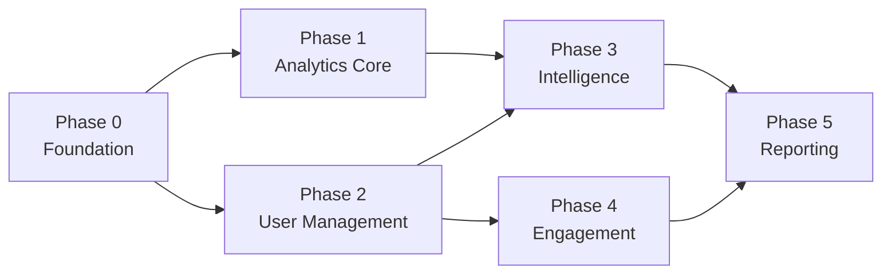

# TappyAI Back Office — Implementation Roadmap

**Version:** 1.0  
**Status:** DRAFT — Awaiting Owner Approval  
**Date:** 2026-07-13

---

## 1. Overview

This roadmap divides the Back Office Platform into 6 sequential phases.

Each phase is independently reviewable and deployable.

No phase begins without explicit owner approval.

Implementation of this roadmap does NOT begin until the complete architecture is approved.

---

## 2. Phase Dependencies

Phases 1 and 2 can run in parallel after Phase 0.

---

## Phase 0 — Foundation

> **Status: 🟡 Implemented · Verified (code-level) · Pending Owner Approval — NOT Completed.**
> Production Verification (PV-1…PV-6) + explicit owner approval are required before this phase is marked Completed. See `phase-reports/PHASE_0_Foundation.md`.

**Goal:** Establish the back office shell, authentication, RBAC, and audit log. Nothing else works without this.

**Estimated scope:** Medium (1–2 weeks)

### Deliverables

#### Database Migrations
- [ ] `admin_roles` table + `admin_role` enum
- [ ] `admin_permissions` table
- [ ] `audit_log` table with immutability policies
- [ ] `system_health_log` table
- [ ] Seed existing `ADMIN_IDS` env var users as `super_admin`
- [ ] Add suspension columns to `profiles` (is_suspended, suspended_until, is_banned, ban_reason)

#### Back Office Shell
- [ ] `src/app/admin/layout.tsx` — Admin shell with navigation sidebar
- [ ] `src/components/admin/layout/AdminShell.tsx`
- [ ] `src/components/admin/layout/AdminNav.tsx`
- [ ] `src/middleware.ts` — Extend to handle `/admin/*` route protection + RBAC

#### RBAC System
- [ ] `src/lib/admin/rbac.ts` — `requireAdminRole()` function
- [ ] `src/hooks/admin/useAdminRole.ts` — Client hook
- [ ] `/api/admin/rbac/roles` — GET + POST endpoints
- [ ] `/api/admin/rbac/roles/[id]` — DELETE endpoint
- [ ] `/admin/rbac` — Role management page (super_admin only)

#### Audit Log
- [ ] `src/lib/admin/audit.ts` — `writeAuditLog()` utility
- [ ] `/api/admin/audit` — GET endpoint (search + filter)
- [ ] `/admin/audit` — Audit log page

#### Home Dashboard (stub)
- [ ] `/admin` — Home dashboard (placeholder cards only)

#### Dev Tools
- [ ] `/api/admin/settings` — GET/PUT settings endpoint
- [ ] `/admin/settings` — Settings page (super_admin only)

### Success Criteria
- Admin user can log in and see the back office shell
- Navigation sidebar renders all modules (with "coming soon" placeholders)
- Role management works (grant/revoke)
- All audit log entries written for RBAC actions
- Non-admin users are redirected

---

## Phase 1 — Analytics Core

**Goal:** Populate the analytics pipeline and build all analytics dashboards.

**Estimated scope:** Large (2–3 weeks)

**Depends on:** Phase 0

### Deliverables

#### Database Migrations
- [ ] `daily_snapshots` table (incl. `is_final`, `reconciled_at`)
- [ ] `feature_usage_rollup` table
- [ ] `cohort_metrics` table
- [ ] `version_analytics` table
- [ ] `ai_usage_log` table
- [ ] `user_active_days` table (rolling active-user source of truth — §8C)
- [ ] `anon_identity_map` table (anonymous → registered stitching — §8D)
- [ ] Add platform/version columns to `track_events`
- [ ] Add `event_id` (UNIQUE), `schema_version`, `anon_id`, `is_unknown_event` to `track_events`

#### Ingestion Hardening (CRITICAL — do before dashboards)
- [ ] `event_id` idempotency: `INSERT ... ON CONFLICT (event_id) DO NOTHING`
- [ ] Payload limits: 100 events/batch, 8 KB/event, per-session rate limit
- [ ] PII rejection + bot filtering in `/api/track`
- [ ] Reporting timezone: all bucketing in `Asia/Ho_Chi_Minh` (§8B)

#### Analytics Pipeline
- [ ] `behavior-rollup` cron (hourly) — UPSERT into `user_active_days` + feature rollup
- [ ] `analytics-snapshot` cron (00:05 VN = 17:05 UTC) — provisional daily snapshot
- [ ] `snapshot-reconcile` cron — re-compute trailing 3 days, mark `is_final=true` (§8A.4)
- [ ] `cohort-rollup` cron — D1/D7/D30 from `user_active_days`
- [ ] `ai-cost-rollup` cron — hourly AI cost aggregation

#### Event Schema Update
- [ ] Update `src/lib/tracking/tracker.ts` to emit full envelope: `event_id`, `schema_version`, platform/version metadata, `anon_id`
- [ ] Rename existing event types to canonical names (see `07_Event_Catalog.md`)
- [ ] Add affiliate/redirect events (`recommendation_shown/clicked`, `affiliate_link_clicked`, `external_redirect_completed`)

#### Feature Flags (foundational — `31_Feature_Flags.md`)
- [ ] `feature_flags` + `feature_flag_overrides` tables + `flag_type` enum
- [ ] `GET /api/flags` resolution endpoint (deterministic bucketing, tier/version/platform gates)
- [ ] Client flag caching + bundled fail-safe defaults (Web first; Android/iOS contract documented)
- [ ] Settings → Feature Flags admin UI + audit logging

#### Data Retention (`34_Data_Retention_Policy.md`)
- [ ] `retention-cleanup` cron enforcing the retention schedule; logs pruned counts

#### Admin API — Analytics
- [ ] `/api/admin/analytics/snapshot` — daily snapshots endpoint
- [ ] `/api/admin/analytics/features` — feature usage endpoint
- [ ] `/api/admin/analytics/cohorts` — cohort metrics endpoint
- [ ] `/api/admin/analytics/ai` — AI usage endpoint

#### Analytics Dashboards
- [ ] `/admin` — Home Dashboard (real data: DAU, MAU, AI, Revenue)
- [ ] `/admin/analytics/product` — Product analytics (feature usage, sessions, search)
- [ ] `/admin/analytics/users` — User analytics (growth, retention, demographics)
- [ ] `/admin/analytics/ai` — AI analytics (cost, tokens, quality)
- [ ] `/admin/analytics/releases` — Release analytics (version adoption, crash rates)

### Success Criteria
- Home dashboard shows real DAU/MAU/revenue from yesterday's snapshot
- Feature usage ranking is visible and accurate
- Cohort table shows D1/D7/D30 rates for last 6 months
- AI cost dashboard shows per-day cost and per-model breakdown

---

## Phase 2 — User Management & Moderation

**Goal:** Give the team full user management and content moderation capability.

**Estimated scope:** Large (2–3 weeks)

**Depends on:** Phase 0

### Deliverables

#### Database Migrations
- [ ] `moderation_queue` table
- [ ] `moderation_actions` table
- [ ] `user_notes` table
- [ ] Add `is_vip` column to `profiles`

#### Admin API — Users
- [ ] `/api/admin/users` — GET (list + search)
- [ ] `/api/admin/users/[id]` — GET (User 360)
- [ ] `/api/admin/users/[id]/suspend` — POST
- [ ] `/api/admin/users/[id]/unsuspend` — POST
- [ ] `/api/admin/users/[id]/ban` — POST
- [ ] `/api/admin/users/[id]/unban` — POST
- [ ] `/api/admin/users/[id]/notes` — POST
- [ ] `/api/admin/users/[id]/force-logout` — POST

#### Admin API — Moderation
- [ ] `/api/admin/moderation` — GET (queue)
- [ ] `/api/admin/moderation/[id]` — GET (case detail)
- [ ] `/api/admin/moderation/[id]/assign` — POST
- [ ] `/api/admin/moderation/[id]/action` — POST
- [ ] `/api/admin/moderation/[id]/dismiss` — POST

#### User-Facing Report Endpoint
- [ ] `/api/reviews/[id]/report` — POST (routes to moderation_queue)

#### Pages
- [ ] `/admin/users` — User list with search/filter
- [ ] `/admin/users/[id]` — User 360 view
- [ ] `/admin/moderation` — Moderation queue
- [ ] `/admin/moderation/[id]` — Case detail
- [ ] `/admin/crm/[id]` — CRM view (same data as User 360, different presentation)

### Success Criteria
- Admin can search and find any user
- Admin can suspend/ban/unban a user with reason
- Suspension is reflected immediately (user cannot access app)
- Moderation queue shows all reported content
- Moderator can take action on a case and it's audit logged

---

## Phase 3 — Intelligence Dashboards

**Goal:** Business analytics, investor dashboard, and AI cost monitoring.

**Estimated scope:** Medium (1–2 weeks)

**Depends on:** Phase 1

### Deliverables

#### Database
- [ ] `investor_share_grants` table (authenticated, revocable, expiring share grants — ADR-009)

#### Admin API
- [ ] `/api/admin/analytics/business` — Revenue + subscription metrics
- [ ] `/api/admin/investor/grant` — POST (create authenticated share grant: password/OTP, expiry)
- [ ] `/api/admin/investor/grant/[id]/revoke` — POST
- [ ] `/api/investor/auth` — POST (password/OTP gate; issues short-lived view session)
- [ ] `/api/investor/view` — GET (requires valid view session; never public — ADR-009)
- [ ] `/api/admin/ai-costs` — AI cost breakdown endpoint
- [ ] `/api/admin/monitoring/health` — System health
- [ ] `/api/admin/monitoring/crons` — Cron execution history

#### Pages
- [ ] `/admin/analytics/business` — Business analytics (MRR, ARR, subs)
- [ ] `/admin/founder` — Founder Dashboard (see `26_Founder_Dashboard.md`)
- [ ] `/admin/investor` — Investor dashboard
- [ ] `/admin/investor/view` — Public investor view (token-gated)
- [ ] `/admin/ai-costs` — AI cost monitoring
- [ ] `/admin/monitoring` — System monitoring

### Success Criteria
- Investor dashboard shows MRR, MAU, D30 retention
- Shareable investor link works without login
- AI cost dashboard shows daily spend and per-model breakdown

---

## Phase 4 — Engagement Center

**Goal:** Campaign management, push notifications, and audience segmentation.

**Estimated scope:** Large (2–3 weeks)

**Depends on:** Phase 2

### Deliverables

#### Database Migrations
- [ ] `notification_campaigns` table
- [ ] `notification_templates` table
- [ ] `audience_segments` table
- [ ] `notification_deliveries` table
- [ ] `in_app_messages` table
- [ ] Extend `notification_subscriptions` for FCM + APNs tokens

#### External Setup (owner-blocked)
- [ ] Firebase project creation + FCM Server Key
- [ ] APNs Auth Key + environment variable configuration

#### Admin API
- [ ] `/api/admin/engagement/campaigns` — GET + POST
- [ ] `/api/admin/engagement/campaigns/[id]` — GET + PUT
- [ ] `/api/admin/engagement/campaigns/[id]/send` — POST
- [ ] `/api/admin/engagement/campaigns/[id]/cancel` — POST
- [ ] `/api/admin/engagement/campaigns/[id]/stats` — GET
- [ ] `/api/admin/engagement/templates` — CRUD
- [ ] `/api/admin/engagement/segments` — CRUD
- [ ] `/api/admin/engagement/segments/[id]/compute` — POST
- [ ] `notification-delivery-check` cron — update delivery stats

#### Pages
- [ ] `/admin/engagement` — Engagement center home
- [ ] `/admin/engagement/campaigns` — Campaign list + create
- [ ] `/admin/engagement/templates` — Template management
- [ ] `/admin/engagement/segments` — Audience segments
- [ ] `/admin/engagement/notifications` — Push notification quick-send

### Success Criteria
- Admin can create a campaign, select a template + segment, and send it
- Delivery stats (sent/delivered/opened) are visible after send
- Web Push campaigns reach subscribed users

---

## Phase 5 — Reporting & Export

**Goal:** PDF/Excel/Word report generation and bulk data export.

**Estimated scope:** Medium (1–2 weeks)

**Depends on:** Phases 3 + 4

### Deliverables

#### Database Migrations
- [ ] `report_jobs` table

#### Dependencies
- [ ] `@react-pdf/renderer` package
- [ ] `xlsx` package (SheetJS)
- [ ] `docx` package

#### Admin API
- [ ] `/api/admin/reports/generate` — POST (async)
- [ ] `/api/admin/reports/[job_id]` — GET (poll status)
- [ ] `/api/admin/reports/[job_id]/download` — GET (auth-gated redirect)
- [ ] `/api/admin/export` — POST (async data export)

#### Report Templates
- [ ] Founder Report (PDF + Excel)
- [ ] Investor Report (PDF + Excel)
- [ ] Product Report (Excel)
- [ ] Moderation Report (PDF + CSV)
- [ ] AI Report (PDF + Excel)

#### Pages
- [ ] `/admin/reporting` — Report generation UI
- [ ] `/admin/export` — Export center

### Success Criteria
- Admin can generate a PDF Investor Report for a date range
- Report downloads correctly and contains accurate data
- Excel export of user list works for admin role

---

## Phase 6 — Experimentation & Optimization

**Goal:** Run controlled A/B tests to drive evidence-based product decisions.

**Estimated scope:** Medium (1–2 weeks)

**Depends on:** Phase 1 (analytics + feature flags) and Phase 3 (KPIs/dashboards)

### Deliverables

#### Database Migrations
- [ ] `experiments` table + `experiment_status` enum
- [ ] `experiment_assignments` table

#### Assignment & Logging
- [ ] Extend `/api/flags` to resolve `variant` flags as experiment assignment (deterministic, sticky)
- [ ] `experiment_exposed` event; anon→user variant carry-over via `anon_identity_map`

#### Admin API & Pages
- [ ] `/api/admin/experiments` — CRUD + start/pause/decide
- [ ] `/admin/experiments` — experiment list, setup, and results view (lift, CI, significance, guardrails)

### Success Criteria
- Admin can define a pre-registered experiment (hypothesis, primary metric, guardrails, sample size)
- Users are deterministically and stickily assigned; exposure logged
- Results view shows per-variant primary metric ± CI, significance, and guardrail status
- Winner ships by ramping the underlying feature flag to 100%

---

## 3. Out of Scope for All Phases (Future Recommendations)

- FCM / APNs push notifications (requires owner to set up Firebase + APNs)
- Two-factor authentication for admin accounts
- AI anomaly detection for moderation
- Customer support integration (Intercom/Zendesk)
- Multi-armed bandit / sequential-inference experimentation (base A/B is now in scope — Phase 6)
- Real-time dashboard with WebSocket (Supabase Realtime)
- Dedicated analytics database (ClickHouse/BigQuery)
- LTV / CAC / NRR business metrics (need acquisition-spend + expansion inputs — `35` marks as FUTURE)

### Post-RBAC cleanup task (tracked)

- [ ] **Remove `ADMIN_IDS` env-var gate** (`src/lib/admin.ts`) once RBAC (`admin_roles`) is fully live and all admins are seeded/verified. Per owner decision (Phase 0), `ADMIN_IDS` is a **deprecated temporary compatibility layer** — no new code may depend on it; all new authorization uses RBAC (`requireAdminRole`). Removal is safe after Phase 0 is deployed, admins are seeded, and no code path references `isAdmin()`.

---

## 4. Approval Checkpoints

| Checkpoint | When | Owner Action Required |
|---|---|---|
| Architecture Approval | Before Phase 0 | ✅ DONE 2026-07-13 — Architecture v1.0 approved & frozen (ADR-012); v1.1 (ADR-013) |
| Phase 0 Completion | After production verification | 🟡 Implemented + code-verified; ⏳ awaiting Production Verification (PV-1…6) + owner approval. Not Completed. |
| Phase 0 Review | After Phase 0 complete | Review foundation; approve Phase 1+2 |
| Phase 1+2 Review | After both complete | Review analytics + moderation; approve Phase 3+4 |
| Phase 3+4 Review | After both complete | Review intelligence + engagement; approve Phase 5 |
| Phase 5 Review | After Phase 5 complete | Final acceptance testing |

---

*End of Implementation Roadmap*
