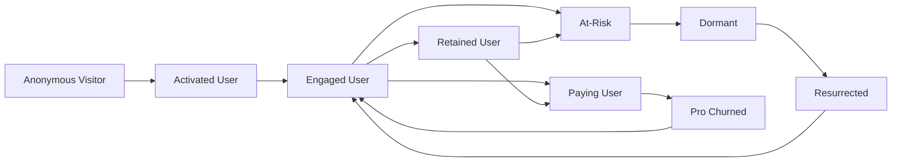
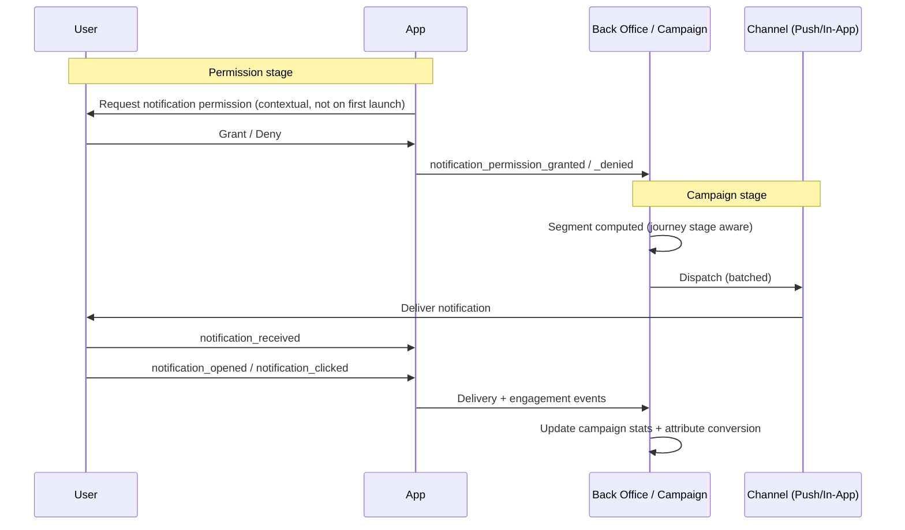

# TappyAI Back Office — User Journey & Notification Journey

**Version:** 1.0  
**Status:** DRAFT — Awaiting Owner Approval  
**Date:** 2026-07-13

---

## 1. Objective

Map the end-to-end user lifecycle and the notification/engagement lifecycle so that (a) every stage has defined events, (b) the back office can measure each transition, and (c) engagement campaigns can be targeted at the right stage. This ties the Event Catalog, Analytics, and Engagement Center together.

---

## 2. User Lifecycle Journey

### Stage Definitions & Signals

| Stage | Definition | Entry Event | Measured In |
|---|---|---|---|
| **Anonymous Visitor** | Using app without account | `anon_session_started` | `anon_id` actives |
| **Activated User** | Registered + completed onboarding | `onboarding_completed` | `profiles`, funnel |
| **Engaged User** | ≥3 active days in first 7 | derived from `user_active_days` | cohort |
| **Retained User** | Active in D30 window | `user_active_days` | D30 retention |
| **Paying User** | Active Pro subscription | `subscription_checkout_completed` | `subscriptions` |
| **At-Risk** | Was active, now 7–14 days idle | absence in `user_active_days` | churn model |
| **Dormant** | 30+ days no activity | absence | churn |
| **Resurrected** | Dormant user returns | `app_session_started` after gap | resurrection metric |
| **Pro Churned** | Subscription lapsed | `subscription_expired` | revenue churn |

### Key Journey Metrics

| Transition | Metric | Owner |
|---|---|---|
| Anonymous → Activated | Signup conversion | Growth |
| Activated → Engaged | Activation rate (aha-moment) | Product |
| Engaged → Retained | D30 retention | Product |
| Engaged/Retained → Paying | Free→Pro conversion | Growth |
| At-Risk → Retained | Win-back rate | Growth |
| Dormant → Resurrected | Resurrection rate | Growth |

### Aha-Moment Hypothesis (to validate, not assumed)

Candidate activation signal: **first successful AI answer + one saved place** within the first session. The back office must be able to test whether users who hit this in session 1 retain better. This is a measurement capability, not a product change.

---

## 3. Notification Journey

### Notification Stages & Events

| Stage | Event | Notes |
|---|---|---|
| Permission requested | `notification_permission_requested` | Ask contextually (after value shown), never at cold start |
| Permission granted/denied | `notification_permission_granted` / `_denied` | Denied users are excluded from push segments |
| Dispatched | `notification_deliveries.status=sent` | Per-recipient row |
| Received | `notification_received` | App-side confirmation |
| Opened | `notification_opened` | Tapped the notification |
| Clicked | `notification_clicked` | Tapped a CTA / deep link |
| Converted | target action event | Attributed within 24h of click |

### Stage-Aware Campaign Targeting

The Engagement Center segments (see `09_Notification_Architecture.md`) can target journey stages:

| Journey Stage | Example Campaign | Channel |
|---|---|---|
| Activated but not Engaged | "Try asking Tappy about lunch near you" | Push (day 2) |
| At-Risk | "We saved your favorite places — come back" | Push + In-App |
| Dormant | Win-back with what's new | Push (if token valid) |
| Free, high usage | "Unlock unlimited with Pro" | In-App at quota moment |
| Pro Churned | Re-subscribe offer | Push + Email (future) |

---

## 4. Notification Frequency Governance

To protect the user experience and avoid opt-outs:

| Rule | Value |
|---|---|
| Max marketing pushes per user | 1/day, 4/week |
| Transactional (security, moderation) | Exempt from cap |
| Quiet hours (VN time) | No marketing push 22:00–07:00 |
| Global unsubscribe | Honored across all marketing channels immediately |

These are enforced server-side at dispatch time, not left to campaign authors.

---

## 5. Journey Analytics in the Back Office

A dedicated view (under User Analytics) shows:
- Funnel across the 6 core lifecycle transitions with conversion % at each.
- Stage distribution: how many users are currently in each stage.
- Cohort flow: how a registration cohort moves through stages over time (Sankey — Future Recommendation for visualization).

---

## 6. Future Recommendations

> NOT in scope.

- Email channel for Pro-churned win-back (requires transactional email provider).
- Predictive at-risk scoring (ML on `user_active_days` decay).
- Sankey visualization of cohort stage-flow.
- Partner postbacks to close affiliate conversion attribution.

---

*End of User & Notification Journeys*
