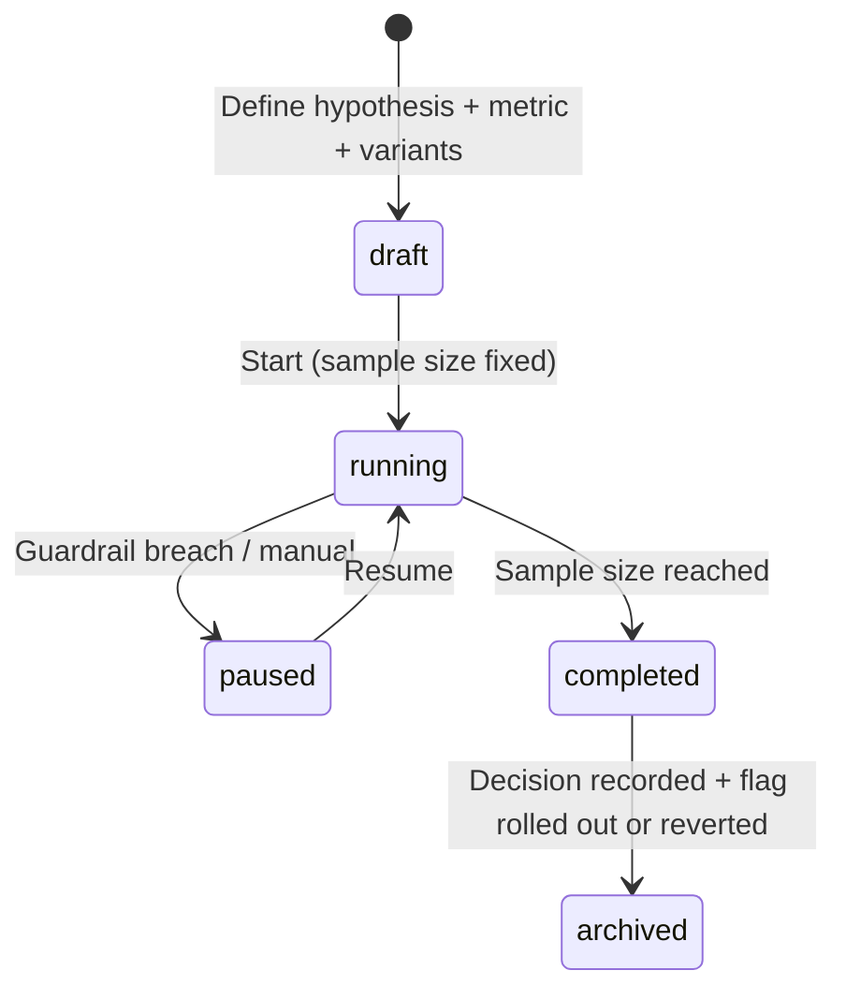

# TappyAI Back Office — Experimentation & A/B Testing Architecture

**Version:** 1.0  
**Status:** APPROVED (v1.0 — brought into scope by owner 2026-07-13, ADR-011)  
**Date:** 2026-07-13

---

## 1. Objective

Define an experimentation platform that lets the team run controlled A/B (and multivariate) tests across Web, Android, and iOS, measure impact on defined KPIs with statistical rigor, and roll out or roll back based on evidence — all through one unified assignment and analysis pipeline.

---

## 2. Why (Purpose)

- Replace opinion-driven changes with evidence: does variant B actually improve retention/conversion?
- De-risk launches: test on a slice before full rollout.
- Attribute impact precisely to a change via randomized assignment.

---

## 3. Foundations & Reuse

Experiments are built on primitives that already exist or are now defined:

| Primitive | Source |
|---|---|
| Variant assignment | `variant` feature flags (`31_Feature_Flags.md`) |
| Event tracking | Unified event pipeline (`06`, `07`) |
| KPI measurement | `25_KPI_Definitions.md` |
| Identity (incl. anon) | `anon_identity_map` (`06` §8D) |
| Funnels | PostHog + `track_events` |

**Decision:** Assignment and logging are **first-party** (our DB, deterministic bucketing) so all three platforms behave identically and data lands in our warehouse. PostHog is used for exploratory funnel/segment analysis on top. This avoids vendor lock-in for the assignment layer while leveraging PostHog for analysis.

---

## 4. Experiment Model

```sql
CREATE TYPE experiment_status AS ENUM ('draft','running','paused','completed','archived');

CREATE TABLE experiments (
    id              UUID PRIMARY KEY DEFAULT gen_random_uuid(),
    key             TEXT NOT NULL UNIQUE,        -- 'onboarding_v2'
    hypothesis      TEXT NOT NULL,               -- "Shorter onboarding raises activation"
    status          experiment_status NOT NULL DEFAULT 'draft',
    flag_key        TEXT REFERENCES feature_flags(key), -- the variant flag driving assignment
    variants        JSONB NOT NULL,              -- [{name:'control',weight:50},{name:'b',weight:50}]
    primary_metric  TEXT NOT NULL,               -- KPI key from 25_KPI_Definitions (e.g. 'activation_rate')
    guardrail_metrics TEXT[],                    -- must NOT regress (e.g. 'crash_rate','d7_retention')
    target_platforms TEXT[] DEFAULT '{web,android,ios}',
    audience_filter JSONB,                       -- optional segment (reuse segment filter shape)
    min_sample_size INTEGER,                     -- pre-computed from power analysis
    started_at      TIMESTAMPTZ,
    ended_at        TIMESTAMPTZ,
    decision        TEXT,                        -- 'shipped_b' | 'kept_control' | 'inconclusive'
    created_by      UUID REFERENCES profiles(id),
    created_at      TIMESTAMPTZ NOT NULL DEFAULT NOW()
);

CREATE TABLE experiment_assignments (
    experiment_key  TEXT NOT NULL,
    subject_id      UUID NOT NULL,               -- user_id or anon_id
    variant         TEXT NOT NULL,
    assigned_at     TIMESTAMPTZ NOT NULL DEFAULT NOW(),
    PRIMARY KEY (experiment_key, subject_id)
);
```

---

## 5. Assignment

- Deterministic, sticky bucketing: `variant = weighted_bucket(hash(experiment_key + subject_id))`. A subject keeps its variant for the experiment's life (recorded in `experiment_assignments` on first exposure).
- Assignment happens server-side (via the flag resolution in `/api/flags`), so all platforms are identical.
- Anonymous subjects are assigned by `anon_id`; if they convert, `anon_identity_map` preserves their variant across the signup boundary (no re-randomization → no contamination).
- Exposure is logged via an `experiment_exposed` event (`experiment_key`, `variant`) the first time the subject actually encounters the tested surface — analysis uses exposure, not mere assignment, to avoid diluting effects.

---

## 6. Analysis

### 6.1 Metrics

- **Primary metric:** one KPI (from `25_KPI_Definitions.md`) declared before start. Only the primary metric determines success.
- **Guardrail metrics:** metrics that must not regress (crash rate, D7 retention, AI cost/user). A win on the primary that breaks a guardrail is not shipped.

### 6.2 Statistical Rigor

| Rule | Requirement |
|---|---|
| Pre-registration | Hypothesis, primary metric, and sample size fixed before start |
| Power analysis | `min_sample_size` computed from baseline rate, MDE, α=0.05, power=0.8 |
| No peeking | Decisions only after sample size reached (or use sequential testing method) |
| Significance | Report effect size + confidence interval + p-value (or Bayesian posterior) |
| One primary metric | Guards against multiple-comparisons false positives |

### 6.3 Results View (Back Office)

Per experiment: variant sample sizes, primary-metric value ± CI per variant, lift %, significance, guardrail status (🟢/🔴), and a recommendation (ship / keep / inconclusive). The final decision is recorded on the experiment and is audit-logged.

---

## 7. Lifecycle



On completion, shipping the winner is done by turning the underlying feature flag to 100% of the winning variant (`31_Feature_Flags.md`), then archiving the experiment.

---

## 8. Back Office UI & RBAC

Under a new **Experiments** area (Product Intelligence group):
- `analyst`: view experiments + results (read-only).
- `admin`: create, start, pause, and record decisions.
- `super_admin`: all, incl. archive.

All state changes are audit-logged (`experiment.created/started/paused/completed/decided`).

---

## 9. Trade-offs & Risks

| Aspect | Note |
|---|---|
| **Benefit** | Evidence-based product decisions; de-risked launches |
| **Trade-off** | Requires discipline (pre-registration, no peeking); sample-size patience |
| **Risk** | Underpowered tests → false conclusions | 
| **Mitigation** | Enforced `min_sample_size`; guardrails; one primary metric |
| **Risk** | Overlapping experiments interfere | 
| **Mitigation** | Flag exclusivity check; document concurrent experiments; keep surfaces disjoint |

---

## 10. Future Recommendations

> NOT in scope.

- Multi-armed bandit auto-allocation.
- Sequential/Bayesian always-valid inference for earlier stopping.
- Holdout groups for long-term effect measurement.

---

*End of Experimentation & A/B Testing Architecture*
