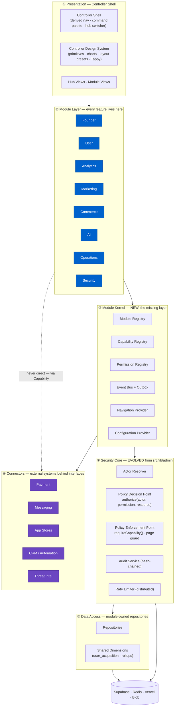
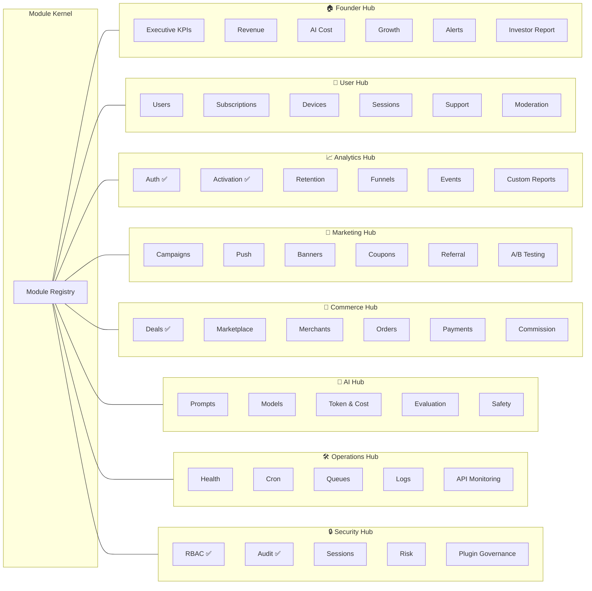
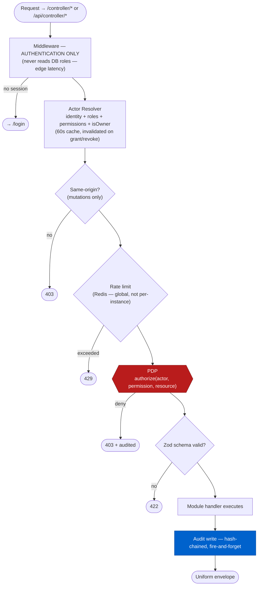
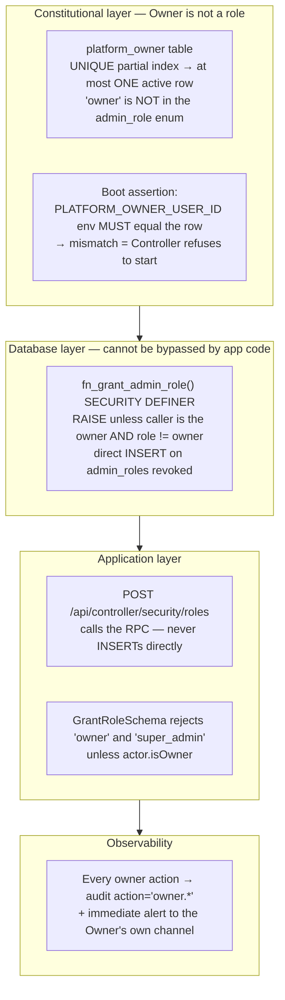
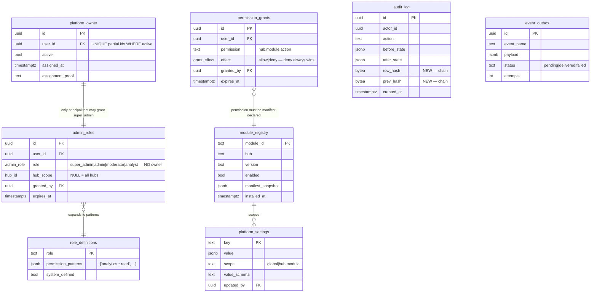
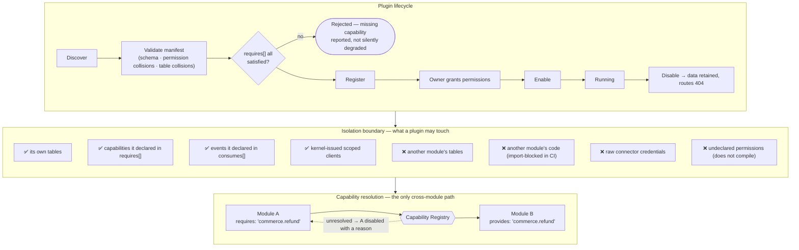
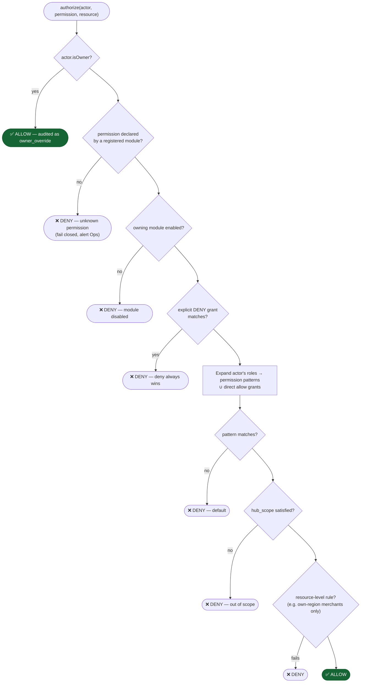
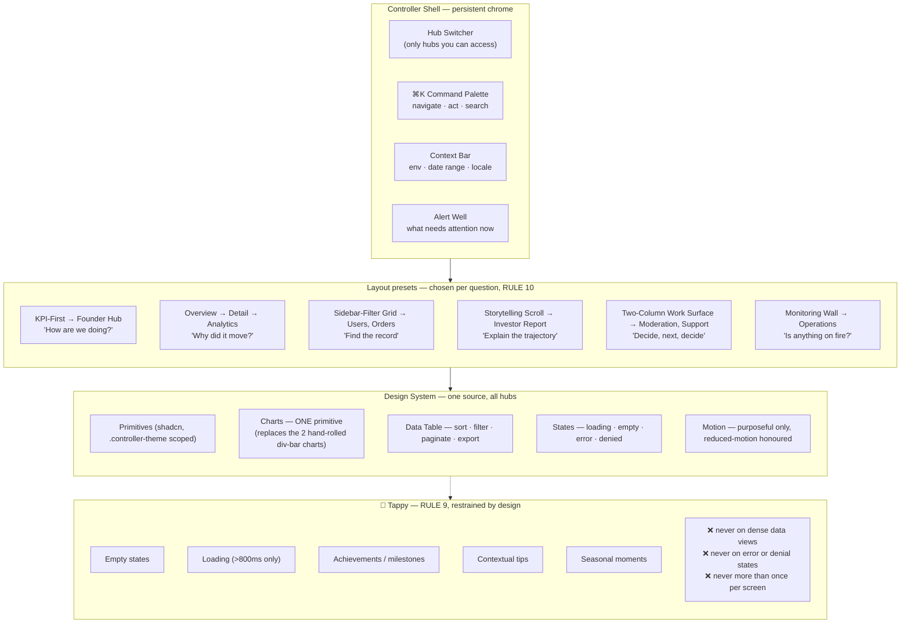

> **⚠️ HISTORICAL DOCUMENT — status superseded by [`STATUS.md`](STATUS.md), the single source of truth.**
> Written before Components 1 & 2 shipped. Its `Status:` line, verdicts and "not yet done" statements were accurate on the date shown and are preserved as the review record. **Current state: Foundation Phase CLOSED; Components 1 & 2 ACCEPTED WITH OPEN PRODUCTION VALIDATION TASK ([BL-002](BACKLOG.md#bl-002--g1-production-validation) open).**

# TappyAI Controller V2 — Architecture

**Status:** Draft for owner approval · **Date:** 2026-08-03
**Scope:** Constitution Steps 4–5 (V2 architecture + the 8 required diagrams)
**Predicated on:** the verdict in `00_LEGACY_AUDIT.md` — *evolve the security kernel, replace the module layer*. If that verdict is rejected, this document must be re-cut.

---

## 0. The one idea

Everything in this document follows from a single structural decision:

> **A module declares what it is. The Controller derives everything else.**

A module ships a manifest — its permissions, its navigation, its events, its capabilities, its tables. From the set of registered manifests the Controller derives the navigation tree, the permission catalogue, the event routing table, the module registry, and the settings surface.

Nothing about a module is written down twice. Adding Commerce Hub means adding manifests, not editing the shell, the permission list, the nav array, and the router. That is the difference between a system that survives 10 years of additions and one that accumulates a merge-conflict funnel at its centre (which, per `00_LEGACY_AUDIT.md` §G3, is what `AdminShell.tsx:25-37` is becoming today).

---

## 1. Architecture Diagram

Six layers. Dependencies point downward only — enforced in CI by extending `scripts/architecture/check.mjs` (which already exists and already works this way for the AI provider layer).



**Hard rules enforced by the Architecture Guard:**

| Rule | Enforcement |
|---|---|
| No module imports another module | Path-pattern rule: `src/controller/modules/<a>/**` may not import `src/controller/modules/<b>/**` |
| No module imports a connector directly | Connectors reachable only via `kernel/capabilities` |
| No module reads the database outside its own repository | `createAdminClient` allowed only in `data/repositories/**` and `kernel/**` |
| No consumer-app import inside the Controller | Keeps a future extraction to its own deployment a build-config change, not a rewrite |
| No permission string literal outside a manifest | Permissions come from the generated registry type |

That last rule is what makes the permission catalogue trustworthy: a permission that is not declared in a manifest does not compile.

---

## 2. Module Diagram

### 2.1 The Module Manifest — the central contract

```ts
export interface ModuleManifest {
  id: ModuleId                    // 'commerce.orders' — globally unique, immutable
  hub: HubId                      // 'commerce'
  version: string                 // semver; migrations gate on it
  title: I18nKey                  // never a raw string — RULE 8 + doc 18

  permissions: PermissionDef[]    // what this module OWNS. Source of truth.
  navigation: NavEntry[]          // what the shell may show. Each carries a permission.
  capabilities: {
    provides: CapabilityId[]      // e.g. 'commerce.refund'
    requires: CapabilityId[]      // resolved by the kernel; missing => module disabled
  }
  events: {
    emits: EventName[]            // declared, so the catalogue is derivable
    consumes: EventSubscription[] // handler bound by the kernel, never by import
  }
  data: {
    tables: string[]              // ownership assertion; no other module may query these
    migrations: string[]
  }
  lifecycle: {
    enabledByDefault: boolean
    canDisable: boolean           // Founder/Security = false; nothing can turn off oversight
    onEnable?: () => Promise<void>
  }
}
```

A module is a directory containing exactly this manifest plus its own views, handlers, repository, and services. It has no other way to reach the rest of the system.

### 2.2 Hub / module map



✅ = exists today and is re-registered through the kernel unchanged. **Six existing modules become the Module Kernel's first consumers** — which is also its acceptance test: if re-registering them requires editing their handlers, the kernel is wrong.

### 2.3 Directory shape

```
src/controller/
  kernel/          registry · capabilities · permissions · events · navigation · config
  security/        actor · pdp · pep · audit · rateLimit        ← evolved from src/lib/admin
  design-system/   primitives · charts · layouts · mascot
  modules/
    <hub>/<module>/  manifest.ts · views/ · api/ · repository.ts · service.ts · events.ts
  connectors/      payment/ · messaging/ · appstore/ · crm/ · intel/
```

---

## 3. Security Diagram

### 3.1 Request path — every request, no exceptions



This is the **existing** `rbac.ts` contract with two substitutions: `hasRole()` → `PDP.authorize()`, and in-memory → distributed rate limiting. The 9 handlers that already implement this contract keep their shape.

### 3.2 The Owner — closing G1

RULE 2 says only the Owner may create a Super Admin and nobody may promote themselves. Today any `super_admin` can mint another (`00_LEGACY_AUDIT.md` §G1). The fix is structural at three independent layers, so no single failure re-opens it:



**Why three layers and not one:** the application check alone is what the current system would have had, and an application bug re-opens it silently. The `SECURITY DEFINER` function means even a fully compromised API route cannot grant `super_admin` — it does not hold the privilege. The boot assertion means a database compromise alone cannot transfer ownership either; an attacker needs the database *and* the Vercel environment.

**Owner powers (RULE 2):** create/delete Super Admin · assign/remove roles · view audit · manage security · install/disable plugins and modules · access every module. The Owner bypasses the PDP by constitutional rule — and every bypass writes an `owner_override` audit row. Unaudited power is the thing that makes an audit log worthless.

### 3.3 Tamper-evident audit — closing G5

`audit_log` today is immutable against RLS but not against the service-role key, which every write path holds.

| Control | Mechanism |
|---|---|
| Hash chain | `row_hash = sha256(prev_hash ‖ canonical_json(row))`, computed in a `BEFORE INSERT` trigger. Deleting or editing any row breaks every subsequent hash. |
| Verifier | Operations Hub job walks the chain daily and alerts the Owner on the first break. |
| Least privilege | Audit writes use a dedicated `audit_writer` role holding `INSERT` only — `UPDATE`/`DELETE` are not granted to *anything*. |
| External shipping | Daily export to write-once storage, so on-platform deletion is still detectable off-platform. |
| Coverage | PDP denials, owner overrides, auth failures, and connector calls all audited — not only successful mutations. |

Note one existing gap this closes: `origin/main:src/app/api/admin/deals/upload/route.ts` is authorized and rate-limited but writes **no audit row**. Under V2, audit coverage is derived from the manifest's declared mutations, so an unaudited mutation is a registration-time failure rather than something a reviewer must notice.

### 3.4 Zero Trust & Secure by Default

- Every handler re-authorizes. No trust inherited from the layout gate. (Already true — preserve it.)
- Deny-by-default at the PDP *and* at RLS. Absence of a grant is a denial.
- New module default: `enabledByDefault: false`, zero permissions until declared and granted.
- No admin API is reachable cross-origin. No secret is readable by any module — connectors hold credentials, modules hold capability handles.
- Frontend validation is presentation only. The Zod schema at the handler is the only validation that exists.

---

## 4. Database Diagram

### 4.1 Kernel schema (new)



### 4.2 Ownership rules (RULE 3 — no shared mutable state)

| Rule | Detail |
|---|---|
| One module owns each table | Declared in `manifest.data.tables`. Cross-module reads go through the owning module's **capability**, never a direct join. **Clarified by [ADR-024](../architecture/ADR-024-module-data-ownership.md), 2026-08-20:** `data` is **optional** and its **absence means the module owns no tables** — which is what all eight shipped manifests are. Collisions are rejected at registration, trimmed and case-folded. `data.migrations` from §2.1 is deliberately absent (migration versioning is undefined). The naming rule below is **not** enforced. |
| Naming | `<hub>_<module>_<entity>` — e.g. `commerce_orders_line_item`. Kernel tables are unprefixed. |
| Shared dimensions are read-only to everyone but their owner | `user_acquisition`, `auth_daily_rollup`, `activation_daily_rollup` stay owned by Analytics (already true today). |
| RLS deny-by-default on every new table | No exceptions. Service-role is the only write path, and it is held only by repositories. |
| Migrations are module-scoped and dependency-ordered | Addresses finding R1 from the prior readiness review: lexicographic filename order silently produced a wrong dependency order. V2 migrations declare `dependsOn`, and the runner topologically sorts — an ordering bug becomes impossible rather than merely documented. |

### 4.3 What happens to existing tables

| Table | Action |
|---|---|
| `admin_roles`, `audit_log`, `system_health_log` | KEEP. `audit_log` gains two hash columns (additive). |
| `admin_permissions` | **DROP** — dead schema, zero code references. Dropped in the same migration that creates `permission_grants`. |
| `user_events`, `user_acquisition`, `*_daily_rollup` | KEEP unchanged. Analytics Hub owns them. |

---

## 5. Plugin Diagram

RULE 5: everything is plugin-ready; modules communicate through events, capabilities, and interfaces — never direct dependency.



**Why capabilities rather than imports:** with imports, replacing the payment module means finding and editing every call site. With capabilities, it means registering a different provider for `commerce.refund`. That is the mechanism that makes RULE 7 (external integration without coupling) actually hold — the Stripe connector and a future VNPay connector are both just providers of the same capability, and no business logic changes when the provider does.

**Governance (RULE 1):** first-party modules are registered at build time from the repo. Third-party plugins require Owner approval, a declared permission set the Owner must explicitly grant, and full audit of their capability calls. A plugin can never acquire a permission it did not declare — the registry rejects at validation, before the plugin ever runs.

---

## 6. Permission Diagram

### 6.1 Model

```
Permission key:   <hub>.<module>.<action>
Examples:         commerce.orders.refund
                  user.profile.read_pii
                  security.rbac.grant_super_admin
                  analytics.auth.export
Wildcards:        analytics.*.read     (role bundles only — never a grant)
```

Permissions are **declared by manifests and generated into a union type**. A permission that no module declares does not exist and does not compile. This replaces the `hasRole()` rank ladder, which — as §G2 of the audit shows — cannot express "high in Commerce, zero in User Hub" at all.

### 6.2 Decision flow



Every DENY is audited with its reason. A permission system whose refusals are invisible cannot be debugged or attacked-detected.

### 6.3 Default role bundles

| Role | Patterns | Notes |
|---|---|---|
| `owner` | *constitutional — not a grantable row* | Bypasses PDP; every action audited |
| `super_admin` | `*.*.*` minus `security.rbac.grant_super_admin` minus `owner.*` | **Cannot create peers.** This is the G1 fix expressed as policy |
| `admin` | `<granted hub>.*.read`, `<granted hub>.*.write` | Hub-scoped via `admin_roles.hub_scope` |
| `moderator` | `user.moderation.*`, `user.profile.read` | No PII, no commerce, no security |
| `analyst` | `analytics.*.read`, `founder.kpi.read` | Read-only by construction |
| `finance` | `commerce.*.read`, `founder.revenue.read` | Cannot read user PII — the case the ladder could not express |
| `support` | `user.profile.read`, `user.support.*` | No role grants, no financial data |

Roles are data in `role_definitions`, not code. Adding `merchant_manager` is a row, not a deploy.

---

## 7. Event Flow Diagram

Modules never call each other. They publish facts; the kernel routes.

```mermaid
sequenceDiagram
    participant U as Admin (or system)
    participant M as Commerce.Orders
    participant K as Event Bus
    participant O as event_outbox
    participant A as Analytics
    participant N as Marketing.Push
    participant Au as Audit

    U->>M: refund order #123
    M->>M: PDP: commerce.orders.refund ✅
    M->>M: execute refund (own tables only)
    M->>K: publish 'commerce.order.refunded'
    activate K
    K->>Au: audit row (hash-chained)
    K->>O: persist — durability BEFORE fan-out
    K-->>M: ack (handler returns; consumers are async)
    deactivate K
    Note over K,O: Response is already sent.<br/>Consumer latency never affects the actor.
    O->>A: deliver → update revenue rollup
    O->>N: deliver → maybe trigger a win-back campaign
    A-->>O: ack
    N--xO: fail → retry w/ backoff → DLQ after N
    Note over O: A failing consumer NEVER<br/>rolls back the refund.
```

**Design commitments**

| Concern | Decision |
|---|---|
| Delivery | At-least-once with an idempotency key. Consumers must be idempotent — the `user_events.event_id` UNIQUE pattern already applied in production is the precedent. |
| Ordering | Per-aggregate only. No global ordering guarantee is offered, because none can be honoured under retry. |
| Failure isolation | A dead consumer cannot block a producer. Failures land in a DLQ surfaced in Operations Hub. |
| Discoverability | The event catalogue is generated from `manifest.events`. `docs/backoffice/07_Event_Catalog.md` becomes generated output rather than a hand-maintained document that can drift. |
| Naming | `<hub>.<entity>.<past_tense_verb>` — `commerce.order.refunded`. Past tense because events are facts, never commands. |
| Schema evolution | Additive only; `schema_version` on every envelope (already the production pattern). |

Consumers are bound by the kernel from `manifest.events.consumes`. Marketing does not import Commerce, and Commerce does not know Marketing exists. That is the property that lets Hub 9 be added in year four without touching Hub 5.

---

## 8. UI/UX Architecture

RULE 8: a premium operating system, not ERP. RULE 10: layout follows the business question. RULE 9: Tappy appears naturally, never as decoration.



**Standards**

| Area | Commitment |
|---|---|
| Navigation | Derived from the Module Registry, filtered by the actor's permissions. **You never see a door you cannot open** — this replaces today's disabled "COMING SOON" placeholder rows. |
| Density | User-selectable comfortable/compact. Operators live here all day; that is not a preference detail. |
| Accessibility | WCAG AA, inherited from the semantic token layer already shipped for the product (`8e53e1e`). Non-negotiable. |
| i18n | VI/EN from day one via `src/lib/i18n/admin`. No raw strings — already the existing convention, keep it. |
| Performance | Dashboards read pre-computed rollups, never live aggregate queries. Existing rule; keep it. |
| Denial UX | A 403 explains which permission is missing and who can grant it. A dead end is a support ticket. |
| Dark mode | First-class, not an afterthought — operators work at night. |

The "premium OS" feeling is not a skin. It comes from the command palette making every action reachable in two keystrokes, from states that are designed rather than defaulted, from motion that means something, and from never showing an operator a control that will reject them.

---

## 9. What this design deliberately does not do

Stating these explicitly, because unstated non-goals become accidental scope:

1. **No microservices.** One deployable, modular inside. Distributed systems are a scaling answer to a problem this system does not have, and they would multiply the security surface eightfold.
2. **No custom auth.** Supabase Auth stays. The Controller adds authorization, never authentication.
3. **No runtime-loaded third-party code in V2.** The plugin *architecture* ships; arbitrary remote code execution does not. First-party modules register at build time. Sandboxing untrusted code is its own multi-month security project.
4. **No premature abstraction.** Extract a shared primitive at the third consumer, not the first. This is the existing SR-4 discipline that produced the current codebase's quality — it stays.
5. **No big-bang migration.** The six existing modules re-register through the kernel with zero behaviour change, and that is the kernel's acceptance test.

---

## 10. Risks

| # | Risk | Severity | Mitigation |
|---|---|---|---|
| R1 | Kernel becomes a god-object | High | Kernel holds routing and resolution only — zero business logic. Enforced by an Architecture Guard rule and a hard size budget. |
| R2 | Permission explosion (hundreds of keys) | Medium | Wildcards in role bundles; permissions declared per module, so they stay bounded by module count. |
| R3 | Event bus becomes an untraceable web | Medium | Generated catalogue; per-event lineage view in Operations Hub; DLQ surfaced, never silent. |
| R4 | Migration of 6 live modules regresses behaviour | High | Re-register with zero handler edits; existing 176 tests are the regression gate; per-module cutover, never all at once. |
| R5 | Governance overhead repeats §G9 | Medium | ADRs bind to the kernel contracts only. Module work inside a stable kernel needs no ADR. |
| R6 | Owner key loss = permanent lockout | **Critical** | Documented break-glass: a DB-level owner-reassignment procedure requiring both database and Vercel env access. **This needs an owner decision before implementation.** |

---

## 11. Awaiting approval

Per Constitution Step 6, **no implementation begins until the owner approves.** Nothing has been built: no code, no migration, no branch change, no dependency added.

Four decisions from `00_LEGACY_AUDIT.md` §5 are still open and materially shape this design — branch baseline, Owner identity mechanism, deployment isolation, and the fate of the frozen `docs/backoffice` v1.1 set. R6 above adds a fifth.

On approval, work begins at **Security Foundation (G1, G2, G4, G5)** — the Owner principal and the permission model — because every hub added on top inherits that authorization root, and it is wrong today.
