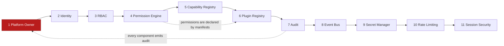

# Controller V2 — Phase 1 Foundation Design

**Status:** Design — awaiting approval before implementation
**Date:** 2026-08-03
**Workspace:** worktree `tappyai-controller-v2`, branch `feat/controller-v2-foundation`, cut from `origin/main` @ `ab13f7f`
**Approved scope:** owner approval 2026-08-03 (three ordered blocks, below)

**No production code written yet.** SQL and TypeScript in this document are *specification*, presented for approval per the Output Rules.

---

## 1. Approved scope and what it changes

| Block | Components (in order) |
|---|---|
| **A — Identity & Authorization** | Platform Owner → Identity → RBAC → Permission Engine |
| **B — Extensibility** | Capability Registry → Plugin Registry |
| **C — Operational Infrastructure** | Audit → Event Bus → Secret Manager → Rate Limiting → Session Security |

Two adjustments this makes to my earlier proposal, now adopted:

1. **Blocks A+B+C are one phase.** My `01_ARCHITECTURE.md` split Security Foundation (Phase 1) from Controller Core (Phase 2). Your ordering merges them. This is the better call: the Permission Engine and the Plugin Registry are mutually constraining — a plugin *declares* permissions, so designing the permission model without the plugin manifest in view risks a model that manifests cannot express.
2. **Conflict C3 is resolved.** Every business Hub, Deals/Commerce included, is **feature-frozen** and migrates to Hub/Plugin only after Block C completes.

### Freeze definition (binding for the duration of Phase 1)

| Allowed on frozen Hubs | Not allowed |
|---|---|
| Security fixes | New features |
| P0 production incidents | New endpoints |
| Mechanical changes required by a foundation cutover (e.g. swapping `hasRole` for the PDP) | New dashboards, new UI surfaces |
| Bug fixes with a reproduction | Refactors of convenience |

The existing `/admin` dashboard receives **no new development** beyond what a cutover mechanically requires — per your point 4.

---

## 2. Component dependency graph

Build order is not arbitrary; each edge is a hard dependency.



The dotted edge from Plugin Registry back to Permission Engine is the reason blocks A and B belong in one phase: **the Permission Engine cannot be finalised until the manifest shape is fixed.** I will therefore design the manifest's *permission-declaration* section during component 4, and implement the rest of the registry at component 6.

---

## 3. Component 1 — Platform Owner

### 3.1 Existing implementation (inspected)

| Artefact | Current state |
|---|---|
| `admin_role` enum (`20260713_backoffice_phase0.sql:22`) | `('super_admin','admin','moderator','analyst')` — **no owner value** |
| `admin_roles` table | `UNIQUE(user_id, role)`, FK to `profiles`, optional `expires_at` |
| `POST /api/admin/rbac/roles` (`route.ts:37-60`) | Requires `super_admin`, then inserts whatever role the body names — **including `super_admin`** |
| `GrantRoleSchema` | Does not exclude `super_admin`; no comparison against the granter's own role |
| `DELETE /api/admin/rbac/roles/[id]` (`route.ts:29-37`) | Refuses to revoke the **last** `super_admin` (lockout guard) |
| Bootstrap | `supabase/seed/backoffice_super_admins.sql` — owner pastes a UUID manually |
| Production state | Exactly 1 active `super_admin` (per prior verified session). **Not re-verified this session — no DB credentials.** |

### 3.2 Current architecture — stated plainly

There is no Platform Owner. The highest principal is `super_admin`, and `super_admin` is **self-replicating**: any holder can create unlimited peers, and nothing distinguishes the founding admin from one granted five minutes ago. The only structural protection is a floor (you cannot remove the last one), not a ceiling.

Your Platform Owner Rules require: exactly one Owner; not creatable from public APIs; no self-promotion; only the Owner may create or demote Super Admins; every privilege change audited; protected by both a table and a boot-time environment assertion.

**None of the six is currently satisfied.**

### 3.3 Proposed change

**Design principle: the Owner is not a role. It is a separate constitutional principal.**

Adding `'owner'` to the `admin_role` enum would be the obvious move and it is the wrong one — the moment Owner is a row in `admin_roles`, it travels through the same grant API, the same UI, and the same code paths as every other role, and "only the Owner may grant it" becomes one more `if` statement to get wrong. Keeping Owner out of that table makes the dangerous operation *structurally unreachable* rather than merely guarded.

**Layer 1 — Schema**

```sql
CREATE TABLE platform_owner (
    id           UUID PRIMARY KEY DEFAULT gen_random_uuid(),
    user_id      UUID NOT NULL REFERENCES profiles(id) ON DELETE RESTRICT,
    active       BOOLEAN NOT NULL DEFAULT true,
    assigned_at  TIMESTAMPTZ NOT NULL DEFAULT NOW(),
    assigned_by  TEXT NOT NULL,          -- 'bootstrap' | 'break_glass' | owner uuid
    revoked_at   TIMESTAMPTZ,
    notes        TEXT
);

-- AT MOST ONE active owner, enforced by the database, not by code.
CREATE UNIQUE INDEX uq_platform_owner_single_active
    ON platform_owner (active) WHERE active = true;

ALTER TABLE platform_owner ENABLE ROW LEVEL SECURITY;  -- deny-by-default
```

`ON DELETE RESTRICT` (not `CASCADE`) is deliberate: deleting the Owner's profile must fail loudly rather than silently leaving the platform ownerless.

**Layer 2 — Privileged operations move into the database**

```sql
CREATE OR REPLACE FUNCTION fn_grant_admin_role(
    p_actor_id   UUID,
    p_user_id    UUID,
    p_role       admin_role,
    p_notes      TEXT DEFAULT NULL,
    p_expires_at TIMESTAMPTZ DEFAULT NULL
) RETURNS admin_roles
LANGUAGE plpgsql
SECURITY DEFINER
SET search_path = public, pg_temp
AS $$
DECLARE
    v_is_owner BOOLEAN;
    v_row      admin_roles;
BEGIN
    SELECT EXISTS (
        SELECT 1 FROM platform_owner
        WHERE user_id = p_actor_id AND active = true
    ) INTO v_is_owner;

    -- Constitutional rule: only the Owner may create a Super Admin.
    IF p_role = 'super_admin' AND NOT v_is_owner THEN
        RAISE EXCEPTION 'FORBIDDEN: only the Platform Owner may grant super_admin'
            USING ERRCODE = '42501';
    END IF;

    -- Constitutional rule: nobody may promote themselves.
    IF p_actor_id = p_user_id THEN
        RAISE EXCEPTION 'FORBIDDEN: self-promotion is not permitted'
            USING ERRCODE = '42501';
    END IF;

    INSERT INTO admin_roles (user_id, role, granted_by, notes, expires_at)
    VALUES (p_user_id, p_role, p_actor_id, p_notes, p_expires_at)
    RETURNING * INTO v_row;

    RETURN v_row;
END$$;

-- The application role loses the ability to write this table directly.
REVOKE INSERT, UPDATE, DELETE ON admin_roles FROM service_role;
```

That `REVOKE` is the load-bearing line. After it, **a fully compromised API route cannot grant `super_admin`** — the privilege simply is not held by the identity the route runs as. The check is no longer something application code is trusted to perform.

**Layer 3 — Boot-time assertion**

`PLATFORM_OWNER_USER_ID` is asserted against the active `platform_owner` row on first use, cached per instance. On mismatch or absence the Controller **refuses to serve `/admin` and `/api/admin/*`** (product routes are unaffected — the consumer app must never be taken down by a Controller misconfiguration).

This means transferring ownership requires **both** database write access **and** the Vercel environment. Neither alone suffices.

**Layer 4 — Bootstrap without UUID handling**

I will not ask you for a UUID and I will not guess one. The bootstrap derives it and fails loudly if the state is ambiguous:

```sql
DO $$
DECLARE v_count INT; v_user UUID;
BEGIN
    SELECT COUNT(*), MIN(user_id) INTO v_count, v_user
    FROM admin_roles
    WHERE role = 'super_admin' AND (expires_at IS NULL OR expires_at > NOW());

    IF v_count <> 1 THEN
        RAISE EXCEPTION
          'Bootstrap aborted: expected exactly 1 active super_admin, found %. Assign the Owner explicitly.', v_count;
    END IF;

    INSERT INTO platform_owner (user_id, assigned_by, notes)
    VALUES (v_user, 'bootstrap', 'Phase 1 bootstrap — promoted from sole super_admin');
END$$;
```

Then a verification query returns the UUID for you to paste into `PLATFORM_OWNER_USER_ID`. **If production does not hold exactly one active `super_admin`, this aborts and we stop and talk** — rather than silently making someone the Owner.

### 3.4 Why this design

| Requirement | Mechanism | Why not the simpler option |
|---|---|---|
| Exactly one Owner | Partial unique index | An application check races under concurrency; the index cannot |
| Not creatable via public API | No API path writes `platform_owner`; break-glass is DB-only | An "admin-only endpoint" is still an endpoint, hence still an attack surface |
| No self-promotion | `p_actor_id = p_user_id` guard inside `SECURITY DEFINER` | An application check is bypassed by any other DB write path |
| Only Owner creates Super Admin | `REVOKE` + `SECURITY DEFINER` | An application check is only as strong as every future route that touches the table |
| Every privilege change audited | Audit at the handler; DB-level trigger added in component 7 | — |
| Table + env assertion | Both, and both required | Either alone makes a single compromise sufficient |

### 3.5 Migration impact

| Area | Impact |
|---|---|
| `admin_roles` schema | **None** — no column or enum change. Rows untouched. |
| Existing admin sessions | **None** — role resolution is unchanged in this component. |
| `POST /api/admin/rbac/roles` | Rewritten to call `fn_grant_admin_role` instead of `.insert()`. Same route, same request/response contract, same status codes. Adds `403` when a non-Owner attempts `super_admin`. |
| `DELETE .../roles/[id]` | Gains an Owner check for demoting a `super_admin`. Existing last-super-admin guard retained. |
| Consumer app (`/`, `/reviews`, `/chat`, …) | **Zero impact.** No shared code path. |
| Frozen Hubs (Deals) | **Zero impact** — Deals grants no roles. |
| Rollback | `DROP FUNCTION`, re-`GRANT` the revoked privileges, `DROP TABLE platform_owner`. The old code path is a one-commit revert. Reversible with no data loss. |
| Downtime | None. Additive DDL; the `REVOKE` lands in the same transaction as the function that replaces the capability. |

**Deployment order is critical and non-obvious:** the `REVOKE` removes an ability the *currently deployed* code depends on. Migration and deploy must therefore land as: apply function + table → deploy code → *then* apply the `REVOKE` as a separate step. Applying the `REVOKE` first breaks role granting in production until the deploy completes. This will be an explicit, gated runbook, not a single bulk migration.

### 3.6 Verification plan

| # | Check | Expected |
|---|---|---|
| V1 | Two active owner rows | Rejected by unique index |
| V2 | Non-Owner `super_admin` calls `fn_grant_admin_role(..., 'super_admin')` | `42501`, API `403`, audited |
| V3 | Any actor grants a role to themselves | `42501`, API `403` |
| V4 | Owner grants `super_admin` | Succeeds, audited |
| V5 | Direct `INSERT INTO admin_roles` as service_role | Permission denied |
| V6 | `PLATFORM_OWNER_USER_ID` mismatched | `/admin` refuses; product routes still 200 |
| V7 | Owner's profile deleted | `ON DELETE RESTRICT` blocks it |
| V8 | Existing admin/analyst/moderator grants | Unchanged behaviour (regression) |

V1–V5 and V8 are automated tests. V6 and V7 require a live environment.

---

## 4. Component 2 — Identity

### 4.1 Existing implementation (inspected)

`src/lib/auth/getRequestUser.ts` resolves a user from either a cookie session (web) or an `Authorization: Bearer <supabase-jwt>` header (Android/iOS), returning an identity-scoped Supabase client so RLS behaves identically for both. This is **well built** — the dual-client design is correct and the in-code reasoning is sound.

`src/lib/admin/rbac.ts:40-64` then resolves a role via `resolveAdminRole(userId)`, returning a single `AdminRole | null`, cached 60s per instance.

### 4.2 Proposed change

`resolveAdminRole` becomes `resolveActor`, returning the full security principal rather than one enum:

```ts
export interface Actor {
  userId: string
  email: string
  isOwner: boolean            // from platform_owner — never from admin_roles
  roles: AdminRole[]          // ALL active roles, not just the highest
  permissions: ReadonlySet<PermissionKey>  // populated by component 4
  source: 'cookie' | 'bearer'
  resolvedAt: number
}

export async function resolveActor(req: Request): Promise<Actor | null>
```

Three changes and their reasons:

- **`isOwner` is resolved from `platform_owner`, never inferred from a role.** The Owner is a distinct principal; conflating it with a role is the mistake component 1 exists to prevent.
- **`roles` becomes a list.** `admin_roles` already permits multiple rows per user (`UNIQUE(user_id, role)`), but `resolveAdminRole` collapses them to the maximum rank, discarding information the Permission Engine needs to union permission bundles.
- **`source` is retained** so session-security work (component 11) can reason about web vs native without re-deriving it.

`getRequestUser` is **kept as-is** and called by `resolveActor`. It is proven and it correctly handles the dual-client case — there is no reason to touch it.

### 4.3 Migration impact

`resolveAdminRole` is retained as a thin shim over `resolveActor` (returning the highest-ranked role) so all existing call sites keep working unchanged during the transition. It is deleted at the end of Block A, once the PDP has replaced every `hasRole` call. This is a transition shim with a defined removal point — not long-term coexistence, per your point 4.

Cache invalidation (`invalidateRoleCache`) extends to owner changes.

---

## 5. Components 3–4 — contracts to be agreed now

I am not designing these in full yet, but the two interfaces below constrain everything after them, so I want them agreed before I build component 1.

**Permission key shape**

```
<hub>.<module>.<action>        commerce.orders.refund
                              security.rbac.grant_super_admin
                              analytics.auth.export
```

**Policy Decision Point**

```ts
authorize(actor: Actor, permission: PermissionKey, resource?: ResourceRef): Decision
// Decision = { allowed: true } | { allowed: false, reason: DenyReason }
```

Evaluation order — **deny wins, default deny**:

1. `actor.isOwner` → allow, audited as `owner_override`
2. permission not declared by a registered module → deny (`UNKNOWN_PERMISSION`)
3. owning module disabled → deny (`MODULE_DISABLED`)
4. explicit deny grant → deny (`EXPLICIT_DENY`)
5. role bundle or direct grant matches → continue, else deny (`NO_GRANT`)
6. hub scope unsatisfied → deny (`OUT_OF_SCOPE`)
7. resource rule fails → deny (`RESOURCE_DENIED`)
8. → allow

Every deny carries a machine-readable reason, is audited, and surfaces in the UI as "you need `X`; `Y` can grant it". Silent 403s are how permission systems become unmaintainable.

---

## 6. Components 5–11 — one-line intent

Recorded so the sequence is legible; each gets its own design document at its turn.

| # | Component | Intent |
|---|---|---|
| 5 | Capability Registry | Named capabilities (`Payment()`, `Notification()`, `LLM()`) resolved by the kernel; the only cross-module call path |
| 6 | Plugin Registry | Manifest validation, dependency resolution, enable/disable/rollback, health checks, migration versioning |
| 7 | Audit | Hash chain, insert-only grant, chain verifier, coverage for denials and owner overrides |
| 8 | Event Bus | Durable outbox, at-least-once delivery, idempotency keys, retry, DLQ. **Net-new — does not exist today** |
| 9 | Secret Manager | Single admin-client construction point (closes S2's three bypasses), typed config validated at boot (closes D5) |
| 10 | Rate Limiting | Shared store; real global caps (closes S4) |
| 11 | Session Security | Session inventory, revocation, forced logout |

---

## 7. Open decisions

**Resolved by owner 2026-08-03:**

1. **Break-glass — APPROVED (Option 1).** SQL runbook requiring **both** Supabase database access **and** a `PLATFORM_OWNER_USER_ID` change in Vercel. No API, no UI, no automation. **Exactly one Platform Owner is retained** — explicitly *no* second active Owner and *no* offline recovery codes.

   Owner-mandated runbook requirements, to be built as part of component 1:

   | Requirement | Implementation |
   |---|---|
   | Documented recovery procedure | Versioned runbook in `docs/controller-v2/runbooks/`, step-gated with per-step verification queries |
   | Maintenance mode | Controller enters a hard maintenance state for the duration — `/admin` and `/api/controller/*` refuse all traffic; the consumer app stays up |
   | Full audit logging | Every break-glass step written to `audit_log` with `action='owner.break_glass.*'`, plus a `platform_owner` row carrying `assigned_by='break_glass'` and the justification in `notes` |
   | Verification before resume | Ownership, boot assertion, and a role-grant smoke test must all pass before maintenance mode is lifted; failure leaves the Controller down rather than half-recovered |

   Note the deliberate consequence: because maintenance mode is entered *before* ownership changes, a break-glass event is never silent — it is visible in the Controller's own availability, which is the intended deterrent.

**Still blocking component 1:**

2. **Production precondition.** The bootstrap requires **exactly one active `super_admin`**. Prior sessions verified this, but I have no DB credentials this session, so it is **Not verified** today. I will run a read-only confirmation before applying anything — and stop if the count is not 1.

**Not blocking (deferred, tracked):**

3. **PostHog** (finding D3) — a decision for the Analytics Hub, not this phase.
4. **Next.js upgrade (finding D1) — RESOLVED and DONE, pending merge.** Owner directed a dedicated security PR, kept entirely separate from Phase 1. Delivered as branch `security/next-14.2.35`, commit `1bad5c2`: `next` and `eslint-config-next` 14.2.5 → 14.2.35, diff limited to `package.json` + `package-lock.json`. Gates green (tsc, 418 tests, lint, architecture 7/7, build 117/117) and a runtime A/B against the 14.2.5 baseline returned 18/18 identical status codes including under four `x-middleware-subrequest` CVE payload variants.

   **Phase 1 implementation does not begin until that PR is merged into `origin/main`**, at which point `feat/controller-v2-foundation` is re-cut from the updated baseline (it is currently based on `ab13f7f`, pre-upgrade).

---

## 8. Requested approval

Approve **component 1 (Platform Owner) + component 2 (Identity)** as designed, and answer decision 7.1 (break-glass), and I will implement them as: migration files + code + tests, verified locally, with the deployment runbook written but **not executed**. Nothing is applied to production without a separate gate.

Per the Output Rules, I am waiting here.
