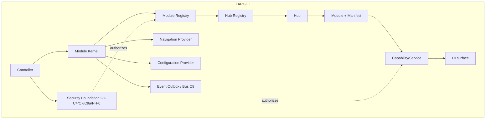

# Controller V2 — FOUNDATION-01 Architecture Contracts

**Status:** Materialized 2026-08-08 from the approved FOUNDATION-01 report.
**Owner direction (LOCKED):** Controller V2 is a **Hub-based Controller Platform**,
not an admin dashboard. Layering:
`Controller → Module Kernel → Module Registry → Hub Registry → Hubs → Modules → Capabilities/Services → UI`.
**Scope of this document:** contracts only. No runtime code, registry, Event Bus,
Hub, UI, DB, or production change is authorised by this file.

Legend: **FROZEN** = ratified, do not change without a new ADR · **OPEN** =
deliberately undecided until the named later component · **OWNER-APPROVAL-PENDING**
= drafted, awaiting explicit owner ratification.

---

## 0. Target vs current architecture


Current reality (MEASURED `526157a`): security foundation deployed; **no** registry /
plugin / event / hub abstraction — hardcoded `/admin` pages + static `NAV[]`.

---

## 1. Controller Core contract — **FROZEN (pending owner ratification)**
The Core orchestrates registration/discovery/enablement/authz/binding/versioning/
config/events/lifecycle/audit/isolation:
- `register(module)` — validate manifest (schema, version, deps, known permissions); fail-closed.
- `registerHub(hub)`; modules attach via `manifest.hub`.
- `discover()` — registry-driven (NOT static imports).
- `enable/disable(moduleId)` — config-driven, audited; disabled ⇒ route + nav + capability unreachable.
- `authorize()` — delegates to the existing PDP (C4); Core never re-implements authz.
- `bindCapability()` — resolve `manifest.capabilities` against the registry (C6); unresolved ⇒ refuse load.
- `resolveDependencies()` — topological; missing/incompatible ⇒ fail-closed.
- `checkVersion()` — semver (§9).
- `resolveConfig()` — precedence chain (§8).
- `emitEvents()` — via §7; impl deferred to C8.
- `attachAudit()` — every state transition writes `audit_log` (C7).
- `isolateFailure()` — a failing module degrades to "unavailable", never crashes Core/others.
**Locked negatives:** static imports ≠ registry; hardcoded NAV ≠ dynamic navigation; a set of pages ≠ a Hub framework.

## 2. Hub contract — **FROZEN (pending ratification)**
A Hub is a first-class governance/composition unit. Fields: `id, name, version,
owner, permissionScope, modules[], navigationGroup, lifecycle, config,
capabilities[], events[], dependencies[], auditBoundary`. **Hub vs Module:** a Hub
*contains and governs* modules, owns a permission scope + nav group, is an audit
boundary; a Module *implements* a capability/surface. A `page.tsx` is at most a
Module surface, never a Hub.

## 3. Module + Module Manifest contract — **FROZEN (pending ratification)**
Required manifest fields: `id` (namespaced), `name`, `version` (semver), `owner`,
`hub`, `capabilities[]`, `permissions[]` (from the registry), `dependencies[]`
(`{moduleId|capabilityId, versionRange}`), `routes[]`, `navigation`
(label/icon/order/visibilityPermission), `lifecycle`
(`experimental|beta|stable|deprecated`), `status` (`enabled|disabled`). Optional:
`description`, `configuration` (schema+defaults), `events`, `featureFlags[]`,
`compatibility` (controller version range).

```jsonc
// DESIGN EXAMPLE — NOT production implementation
{
  "id": "tappy.hub.security.rbac", "name": "RBAC", "version": "1.0.0",
  "owner": "platform", "hub": "tappy.hub.security",
  "capabilities": ["security.roles.read", "security.roles.write"],
  "permissions": ["SECURITY_ROLES_READ", "SECURITY_ROLES_WRITE"],
  "dependencies": [{ "capabilityId": "audit.write", "versionRange": "^1" }],
  "routes": ["/controller/security/rbac"],
  "navigation": { "label": "admin.nav.roles", "icon": "KeyRound", "order": 30, "visibilityPermission": "SECURITY_ROLES_READ" },
  "lifecycle": "stable", "status": "enabled", "compatibility": { "controller": "^1" }
}
```

## 4. Capability contract — **FROZEN via [ADR-018](../architecture/ADR-018-capability-registry-frozen.md)**
C5 folds into C6; not standalone; `capabilities.ts` inert until C6. A capability =
`{id, version, owner, permissions[], dependencies[], provider(moduleId),
consumers[]}`. Providers register via manifest; consumers declare in `dependencies`;
binding is Core-resolved, fail-closed.

> **Clarified 2026-08-22 — the section above describes the MODULE axis, and only that.** It says what a capability is,
> who provides it and who consumes it. It never said how an **actor** acquires one, which is why `Actor.capabilities`
> stayed empty and K-1 was classified as needing an Owner decision rather than an implementation.
>
> [**Owner Decision D-K1**](OWNER_DECISIONS_2026-08-22.md#d-k1--the-actorcapability-binding-role-derived) supplies that
> missing edge: for Controller V2 an actor's capabilities are **derived from the actor's effective role permissions** —
> a read-only projection, never an authorization source. The module axis defined above is **unchanged**; the two share
> an id space but are different relationships.

## 5. Plugin / Module contract — **FROZEN (pending ratification)**
A **Plugin** = a distributable bundle of Module(s) + Capabilities; every Module is
manifest-describable. **Initial scope: first-party only** (no third-party loading).
Lifecycle `register → validate → enable → ready → (disable) → deregister`;
enable/disable audited; failure isolated. Implementation = C6.

## 6. Event contract — **fields FROZEN; delivery now DEFINED by C8**
Event = `{id, type, version, producer, actor, timestamp, correlationId, payload,
metadata, securityClass}`. **FROZEN:** every event carries actor + correlationId +
securityClass; security-relevant events integrate with C7 audit.

**No longer open.** Ordering, persistence/outbox durability, retry, idempotency,
delivery and consumer registration were listed here as *"OPEN — defer to C8, not
invented here"*. They are defined by
[`08_COMPONENT8_EVENT_BUS_CONTRACT.md`](08_COMPONENT8_EVENT_BUS_CONTRACT.md) plus
`01_CONTROLLER_V2_ARCHITECTURE.md` §7, ratified as binding by Owner decision
2026-08-13: at-least-once, per-aggregate ordering only, an outbox row per
(event, consumer), 3 attempts then DLQ, and consumers bound from
`manifest.events.consumes`. **The field freeze above is unchanged.**

## 7. Configuration / feature-flag contract — **FROZEN (provider impl deferred)**
Precedence (high→low): **runtime (DB/API) > feature flags > environment >
build-time defaults**, plus module configuration (manifest) and user/role
preferences (never override security). Owner: Config Provider (Core).
`BACKOFFICE_ENABLED` = **REFACTOR** (currently displays, enforces nothing).

## 8. Versioning contract — **FROZEN (negotiation impl deferred)**
Semver on Controller/Hub/Module/Capability/Event. Rule: incompatible dependency ⇒
the depending module **fails to load (fail-closed), audited, surfaced as
unavailable** — never a silent partial load.

## 9. Security integration — **FROZEN · existing foundation KEEP, untouched**
Authorization flow: `Controller → Permission (registry) → PDP (C4) → Capability
binding → Module → Hub → UI`. C1 Owner gate before RBAC; C3 via SECURITY DEFINER
RPCs; C7 audit on mutations + denials; C9a single admin-client boundary; PH-0
grants hardened (verified live). **UI is never the security authority.** No security
code changes in Foundation-01.

## 10. Backend ownership principle — **FROZEN**
**BACKEND OWNS BUSINESS BEHAVIOR; UI OWNS PRESENTATION/INTERACTION.** Recorded
violations (not fixed here): content-analytics page fetches/aggregates in-UI →
REFACTOR; `p_actor_id` trusted from caller in grant/revoke RPCs → **B1 security
follow-up (remains explicit)**.

---

## 11. KEEP / REFACTOR / REMOVE — decision record (no code changed)
| Module | Decision | Target V2 location | Migration | Blocking dep |
|---|---|---|---|---|
| `lib/admin/permissions/**` | KEEP | Core authz provider | wrap | none |
| `owner.ts` (C1), `rbac.ts`/`roles.ts` (C2/C3), `audit.ts` (C7) | KEEP | Security foundation | none | none |
| `/api/admin/*` routes | KEEP | Capability/Service layer | expose as capabilities | none |
| `AdminShell.tsx` | REFACTOR | Controller shell | consume Navigation Provider | Hub framework |
| `nav.ts` (static `NAV[]`) | REFACTOR | Navigation Provider | derive from registered modules | Module Registry |
| `HomeDashboard.tsx` | REFACTOR (later) | Founder/Home Hub module | after owner design + `daily_snapshots` | owner + pipeline |
| `DealsManager.tsx` | REFACTOR (i18n polish) | Commerce Hub module | i18n + manifest | Hub framework |
| `admin/analytics/page.tsx` (Content) | REFACTOR → rebuild | Analytics Hub module | service + API + manifest | backend contract |
| `src/lib/admin.ts` (`ADMIN_IDS`/`isAdmin`) | REMOVE (after 1 caller migrates) | — | migrate `music/tracks/[id]/report` to `requirePermission` | none |
| `BACKOFFICE_ENABLED` | REFACTOR or REMOVE | Config Provider flag | wire or drop | config model |
| `capabilities.ts` (C5) | KEEP (reserved) | Capability Registry | activate at C6 | ADR-018 + C6 |
| existing admin pages (rbac/audit/analytics/deals/settings) | REFACTOR | Modules under Hubs | migrate onto Hub framework | Hub framework |

## 12. Legacy migration principle — **FROZEN**
Evolve-if-safe (KEEP/REFACTOR) else REMOVE-after-replacement-proven. **Never run
legacy + V2 in parallel for the same responsibility; no duplicate business logic;
no duplicate authorization paths; no shadow security paths.** Migration is gated on
the Core + Hub framework existing first.

## 13. UI architecture boundary — **OWNER-APPROVAL-PENDING**
Boundary only (no UI built): Controller shell → Hub shell → module surface fed by a
Navigation Provider; permission-aware rendering; per-module loading/error
boundaries; module isolation; dark mode + responsive. All `docs/backoffice/**` UI
specs remain **DRAFT — OWNER APPROVAL REQUIRED**; not promoted to implementation
spec.
