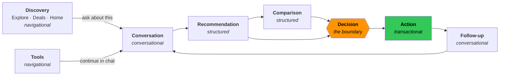

# TappyAI V3 — Information Architecture

**Phase:** 4A — **Revision V2** (post human review) · **Status:** Reflects APPROVED decisions
**Implementation:** NOT STARTED · **Production:** UNCHANGED · **Phase 4B:** BLOCKED

> **Revision V2 — approved constraints binding on this IA**
> - **DD-003:** five tabs, unchanged. **No Inbox tab. No sixth tab of any kind.**
> - **DD-002 / OD-1:** Home is AI-first (primary action + visual hierarchy) but **Home ≠ Chat**;
>   no tool is removed.
> - **OD-2:** Explore keeps its existing identity. **No large IA rewrite.** Only the
>   conversational bridge is added.
> - **OD-3:** Deals stays top-level, not merged, not a Marketplace.
> - **OD-4:** Inbox placement is **HOLD** — current location retained; alternatives documented in
>   `V3_DESIGN_DECISIONS.md`, no decision taken.
> - **ND-001:** "For You" is a **discovery/content preview** using existing V3-available
>   data/capabilities. **Not a personalization system**; no profiling, ranking or recommendation
>   backend is in scope.
> - **DD-015:** this IA may be proposed and revised, but **must not be implemented** before
>   approval.

> **Scope note.** Phase 4 Design v1 stated "no changes to navigation or information architecture."
> That was too strong and is **corrected here**: navigation and IA are explicitly named in
> `04-V3-DESIGN/V3-Design.md` for both Web and App. The correct rule is:
> **navigation and IA must not be changed *by implementation* before human approval.**
> This document proposes; it does not implement.

---

## 1. Current-state IA (audited)

### 1.1 Primary navigation — already at parity

All three platforms use the same five tabs. This is genuinely good and is **not** proposed for
change.

| Tab | Web (`BottomNav.tsx`) | Android (`HomeTab.kt`) | iOS (`AppTab.swift`) |
|---|---|---|---|
| Home | `/` | `HomeRoute.Home` | `.home` |
| Chat | `/chat` | `HomeRoute.Chat()` | `.chat` |
| Explore | `/reviews` | `HomeRoute.Explore` | `.explore` |
| Deals | `/deals` | `HomeRoute.Deals` | `.deals` |
| Profile | `/profile` | `HomeRoute.Profile` | `.profile` |

### 1.2 Current Home — a tool launcher

`src/app/HomeView.tsx` in source order:

```
┌─────────────────────────────────────────┐
│  Header                                 │
│  ┌───────────────────────────────────┐  │
│  │  SearchBar (hero) → /chat?q=…     │  │  ← the only AI entry, visually a search box
│  └───────────────────────────────────┘  │
│  CategoryPills                          │
├─────────────────────────────────────────┤
│  Bói:  Tarot · Tử Vi · Cung Hoàng Đạo   │
│  Scan                                   │
│  Group Dining                           │
│  Recommendations │ Music                │   ~12 tool tiles
│  Currency │ Split Bill                  │
│  Translate │ Scam Shield                │
│  Viet Content                           │
├─────────────────────────────────────────┤
│  Suggested prompts  → /chat?q=&category=│  ← AI, below the fold
│  Recent conversations → /chat/[id]      │
└─────────────────────────────────────────┘
│  BottomNav: Home · Chat · Explore · Deals · Profile │
```

### 1.3 Findings

| # | Finding | Evidence |
|---|---|---|
| **IA-1** | **The entry point is not AI-first.** The assistant is one tab and, on Home, appears as a search box above a tool grid, with prompts and conversations below the fold. | `HomeView.tsx` order |
| **IA-2** | **Home has no hierarchy.** ~12 tools are presented as near-equal tiles with no grouping by need or frequency. | `HomeView.tsx:84–216` |
| **IA-3** | **"Explore" means the Reviews feed, not discovery.** It also **hosts the Inbox** (unread badge on the Explore tab), so one tab carries two unrelated jobs. | `BottomNav.tsx:9–15, 46` |
| **IA-4** | **Explore replaces global navigation.** `/reviews` renders its own TikNav and `BottomNav` returns `null`, so the user leaves the app's navigation model inside a tab. | `BottomNav.tsx:26` |
| **IA-5** | **Discovery dead-ends.** A user who finds something in Explore or Deals cannot carry it into the assistant; there is no "ask about this". | No such entry point exists |
| **IA-6** | **Tools dead-end symmetrically.** A tool result (a scan, a split bill) cannot be continued in conversation. | No such entry point exists |
| **IA-7** | **The action boundary is invisible.** Advice and action share one visual language; there is no shared confirmation surface (D4). | No confirmation primitive |
| **IA-8** | **Comparison has no home.** Nothing in the IA hosts a multi-option decision (D3). | Absent on all platforms |

**IA-1 is the structural problem** named in `V3_PRODUCT_STRUCTURE.md §6`. IA-5 and IA-6 are the
reason the product feels like separate features rather than one assistant.

---

## 2. Proposed V3 IA

### 2.1 Principles

1. **One loop, many doors.** Discovery, tools and conversation all lead to the same
   consult → recommend → decide → act → follow-up loop.
2. **Do not force everything into chat.** Browsing, tools and settings stay navigational.
   Conversation is the primary door, not the only one.
3. **Do not force everything into navigation.** A decision is not a destination; it happens
   in place.
4. **Preserve reachability.** No tool becomes harder to reach than today.
5. **Change emphasis, not structure.** The five tabs stay; what leads inside them changes.

### 2.2 The V3 spine



### 2.3 Content-type classification

Required by the brief — what is conversational, structured, navigational, transactional,
informational:

| Layer | Type | Surfaces |
|---|---|---|
| **Conversational** | free-form, user-initiated | Chat thread, clarification, follow-up chips |
| **Structured** | AI output rendered as UI | RecommendationCard · ComparisonBlock · PlanCard · DecisionBlock · OfferRow · MatchBadge |
| **Navigational** | browsable, persistent | Home · Explore · Deals · Tools · Profile · History |
| **Transactional** | consequential, confirmed | ConfirmationPrompt · booking · save · share · subscription |
| **Informational** | static, no decision | Legal · How-to-use · Settings copy · error explanations |

**Rule:** a surface must not mix transactional and conversational affordances without an explicit
confirmation step between them. This is the IA expression of the action boundary.

### 2.4 Proposed hierarchy

```
TappyAI
│
├── Home ······································· [AI-FIRST ENTRY — NOT a chat screen]
│   ├── Ask Tappy (composer + contextual suggestions)     ← primary action
│   │     └── submit → navigates to Chat (Home never streams a reply)
│   ├── Continue (recent conversations / active plans)    ← promoted
│   ├── For You (discovery/content preview — existing sources; NOT personalization)
│   └── Tools (grouped, "see all" — NOTHING REMOVED)      ← de-emphasised, fully reachable
│
├── Chat ······································· [CONVERSATIONAL]
│   ├── Thread (streaming, structured blocks, actions)
│   ├── Comparison (in-thread, expandable)                ← NEW
│   ├── Confirmation (inline or sheet)                    ← NEW (shared)
│   └── History
│
├── Explore ···································· [NAVIGATIONAL → conversational]
│   ├── Feed (Reviews — IDENTITY AND BEHAVIOUR UNCHANGED, OD-2)
│   ├── "Hỏi Tappy về chỗ này"                            ← NEW entry into the loop
│   └── Inbox / notifications        ← OD-4 HOLD: stays where it is; no new tab
│
├── Deals ······································ [NAVIGATIONAL → conversational]
│   ├── Deal list / detail (unchanged)
│   └── "Ask Tappy about this"                            ← NEW
│
├── Tools ······································ [NAVIGATIONAL, preserved]
│   └── Scan · Scam Shield · Split Bill · Translate · Currency ·
│       Group Dining · Music · Fortune · Viet Content · Games · Price Watch
│       └── "Continue in chat" where a result exists      ← NEW
│
└── Profile ···································· [NAVIGATIONAL]
    ├── Account · Preferences · History · Favourites · Bookings
    ├── Price watches · Posts · Integrations
    └── Notifications · Subscription · Language · Legal
```

**Only two things move:** Home's internal order (assistant promoted above tools), and the addition
of *entry points into the loop* from discovery and tools. **Nothing is removed. No route changes.
No tab changes.**

### 2.5 Old → new mapping

| Today | V3 | Change | Impact |
|---|---|---|---|
| Home = tool grid, search on top | Home = **AI-first entry** (Ask Tappy primary), tools grouped below — **not a chat screen** | **Reorder + group** | A |
| Search bar → `/chat?q=` | Composer → `/chat?q=` (same route) | Presentation only | A |
| Suggested prompts below tools | Contextual prompts under the composer | Reorder | A |
| Recent conversations at bottom | "Continue" near the top | Reorder | A |
| ~12 flat tool tiles | Grouped, with "see all" | Grouping | A |
| Explore → Reviews feed | Unchanged **+** "Ask Tappy about this" | Additive | A |
| Deals | Unchanged **+** "Ask Tappy about this" | Additive | A |
| Tool result | Unchanged **+** "Continue in chat" | Additive | A |
| No comparison | ComparisonBlock in thread | New UI | A / C |
| Ad-hoc confirmations | Shared ConfirmationPrompt | New primitive | A |
| Explore tab hosts Inbox | **OPEN — OD-2 / OD-4** | Undecided | — |
| Tabs (5) | Tabs (5) | **No change** | — |
| All routes | All routes | **No change** | — |

**Every proposed IA change is impact class A** — presentation and client-side routing only. No
backend, no API, no schema.

---

## 3. Entry points into the loop

The IA's core V3 addition. Each is a small, additive affordance, not a new surface.

| From | Affordance | Carries | Lands in |
|---|---|---|---|
| Home composer | Type / speak / attach | The user's words | Chat thread |
| Home contextual prompt | Tap | A pre-formed question | Chat thread |
| Home "Continue" | Tap | Existing conversation | Chat thread |
| Explore item | "Ask Tappy about this" | Entity reference | Chat thread, pre-contextualised |
| Deal item | "Ask Tappy about this" | Deal reference | Chat thread, pre-contextualised |
| Tool result | "Continue in chat" | Tool output as context | Chat thread |
| Notification | Tap | Deep link | The relevant thread or item |

> **Contract note.** "Ask Tappy about this" carries an **entity reference**, not a fabricated
> question. Whether the existing `/chat?q=` query parameter is sufficient, or whether a structured
> context parameter is needed, is an **impact class C** question to settle in Phase 4B — the
> preference is to reuse `?q=` plus existing context handling (class B) and only escalate if that
> proves insufficient. **No backend change is assumed.**

---

## 4. Navigation model per platform

Detail lives in the Web and App proposals; this is the IA-level contract.

| | Web | Android | iOS |
|---|---|---|---|
| Primary | Bottom tabs (mobile) / header + tabs (desktop) | Bottom `NavigationBar` / `NavRail` at width | `TabView` |
| Secondary | In-page sections, routes | Nested `NavHost` per tab | `NavigationStack` per tab |
| Contextual | In-thread blocks, sheets | Bottom sheets | `.sheet` |
| Back | Browser back | System back / predictive gesture | Swipe-back |
| Return to context | Route history; thread preserved | Tab back stack preserved | Stack preserved per tab |
| Deep link | URL | Intent (`core:deeplink`) | Universal link |

**MUST MATCH:** which surfaces exist, what each contains, which actions are available, and that an
in-progress conversation or plan survives navigating away and back.
**MAY DIFFER:** the mechanics above.

---

## 5. Preserving context (explicitly required)

| State | Requirement |
|---|---|
| Active conversation | Survives tab switch, backgrounding, and rotation |
| Streaming response | Continues or resumes cleanly; partial text preserved on stop |
| Draft message | Preserved per thread |
| Attachment | Preserved until sent or removed |
| Structured result | Persisted with the message; re-read, **never regenerated** |
| Plan | Persisted; reachable from Home "Continue" |
| Comparison | Persisted with the message that produced it |
| Pending confirmation | **Never auto-confirms**; cancelled on navigate-away |

The last row is a security-relevant rule: an abandoned confirmation must fail closed.

---

## 6. What this IA does *not* do

- Does not change the tab set, tab order, or any route
- Does not remove, rename or relocate any tool
- Does not introduce a new top-level concept
- Does not force browsing or tools into chat
- Does not add a dashboard, wizard, or onboarding tour
- Does not surface commerce, marketplace, or CS-Cart structures
- Does not change Explore's feed behaviour (only adds one affordance)
- Does not alter the Controller / Back Office IA

---

## 7. IA decisions — status after Revision V2

| # | Decision | Status | Outcome |
|---|---|---|---|
| **OD-1** | Strength of "AI-first Home" | ✅ **RESOLVED** | Primary action + visual hierarchy. **Home ≠ Chat.** No tool removed. |
| **OD-2** | Explore's identity | ✅ **RESOLVED** | Keep existing identity. Bridge only. **No large IA rewrite.** |
| **OD-3** | Deals as a top-level tab | ✅ **RESOLVED** | Keep. Not merged. Not a Marketplace. |
| **OD-4** | Inbox location | 🔴 **HOLD** | **No new top-level navigation.** Current placement retained. Four alternatives recorded in `V3_DESIGN_DECISIONS.md`; a dedicated Inbox tab is **excluded**. |
| **OD-6** | Desktop Web ambition | 🟡 **PROVISIONAL** | Responsive, no sidebar — subject to final Web design approval. |

**IA-3 (Explore carrying both the feed and the Inbox) is acknowledged but deliberately not
resolved in V3.** It is a real IA smell; moving it is user-visible, unmandated by the V3 scope, and
the review explicitly placed it on hold. It is recorded so it is not lost, not so it is fixed here.

**Nothing in this IA may be implemented before approval (DD-015).**
