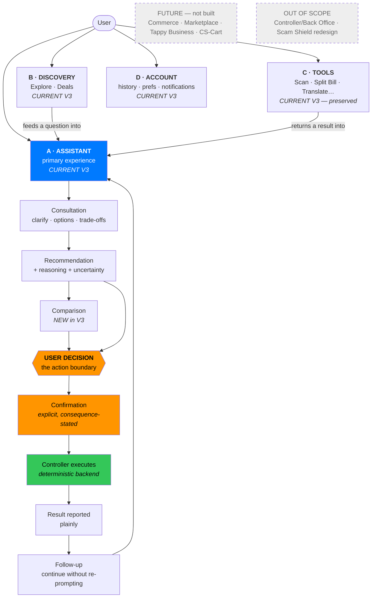

# TappyAI V3 — Product Structure

**Phase:** 4A — **Revision V2** (post human review) · **Status:** Reflects APPROVED decisions
**Branch:** `design/v3-phase4` · **Base:** `0e9a31e`
**Implementation:** NOT STARTED · **Production:** UNCHANGED · **Phase 4B:** BLOCKED

> **Revision V2 — approved constraints now binding on this document**
> - **DD-002 / OD-1:** Home is AI-first — *primary action and visual hierarchy* centre on asking
>   Tappy — **but Home is NOT Chat**, and **no tool is removed** to achieve it.
> - **DD-003:** five tabs, unchanged. No sixth tab.
> - **OD-2:** Explore keeps its existing identity; only the conversational bridge is added.
> - **OD-3:** Deals stays top-level; not merged; not a Marketplace.
> - **DD-001 / DD-013:** commerce remains FUTURE; primitives only, where justified.
> - **OD-4:** Inbox placement is **HOLD** — no new top-level navigation.
> - **OD-5:** spacing tokens are **HOLD**; no migration is approved.
> - **OD-7:** the V3 scope documents are now committed at **`docs/v3-scope/`**.
> - **ND-001:** Home's "For You" is a **discovery/content preview** using existing V3-available
>   data/capabilities — **not a personalization system.** No user profiling, ranking engine,
>   behavioural scoring, personalization backend, or new AI ranking logic is in V3 scope.

---

## 0. Source of truth

This document derives from the four V3 scope documents (`TappyAI-V3.zip`, **not in the
repository** — extracted for this phase). Where those documents do not define something, it is
marked **OPEN DESIGN DECISION** rather than invented.

| Document (now in-repo) | What it fixes |
|---|---|
| `docs/v3-scope/00-V3-Master-Scope.md` | The four V3 workstreams; what is explicitly out of scope |
| `docs/v3-scope/01-AI-Consultative.md` | Consultative behaviour; the **action boundary** |
| `docs/v3-scope/02-Cost-Optimization.md` | Cost mechanics (must remain invisible) |
| `docs/v3-scope/03-Security.md` | The **security boundary** |
| `docs/v3-scope/04-V3-Design.md` | The Web and App design mandate |

> **OD-7 APPROVED — DONE.** These documents previously existed only in
> `~/Downloads/TappyAI-V3.zip`. They have been copied **verbatim and byte-identical** into
> `docs/v3-scope/` so future audits cannot drift from them. Their content was **not** rewritten,
> summarised or edited. This is a governance action only and authorizes no implementation.

### 0.1 What the master scope actually says

> Current V3 scope: **1. AI Consultative · 2. Cost Optimization · 3. Security · 4. V3 UX/UI
> Design**
>
> Explicitly out of current V3 scope: **Tappy Business · Marketplace · CS-Cart implementation ·
> Commerce ecosystem** — all future work.
>
> Reuse, do not rebuild: **Controller** (built in V2), **Scam Shield** (completed).

This **materially constrains** Phase 4. It also corrects an over-reach in Phase 4 Design v1, which
described "commerce/discovery foundations" as in-scope for the current release. Commerce is
**FUTURE**; only design primitives that avoid future rework are **V3 FOUNDATION**.

---

## 1. What TappyAI V3 is

> A person states a need in their own words and is helped toward a better real-life decision —
> with less effort and greater confidence. (MUXS §1)

V3 does not add a product area. **V3 changes the quality of the core loop:** from
question-answering to **consultative decision support** (`AI-Consultative.md`).

The V3 spine, taken verbatim from the scope documents:

```
User → AI understanding/consultation → recommendation → user decision → Controller/action
```

Two properties of that spine are non-negotiable and drive most of this design:

1. **The AI advises; it never commits.** *"The AI must not become the authority for consequential
   backend actions."*
2. **Everything consequential is deterministic and routed through the Controller**, behind
   policy/guardrails and permission/scope validation (`Security.md`).

**Design consequence:** the interface must make *advice* and *action* visibly different things,
and the moment of transition between them — the user's decision — must be explicit. This is why
`ConfirmationPrompt` (finding D4) is a V3 requirement, not a nicety.

---

## 2. Product areas

TappyAI today is one assistant plus a large set of utilities. V3 organises this into four areas.
**No new area is invented** — this is a re-description of what exists, plus the consultative layer.

### A · Assistant  — *the primary product experience*
Conversation, consultation, recommendation, comparison, planning, action, follow-up.
**Scope: CURRENT V3.** This is where all four V3 workstreams land.

### B · Discovery — *how a user finds something without asking*
Today: the Explore/Reviews feed, Deals, category entry points, suggested prompts.
**Scope: CURRENT V3 (surfaces already exist) — no new discovery system is built.**
V3's change is that discovery **feeds the assistant** rather than dead-ending.

### C · Tools — *the utility suite*
Scan, Scam Shield, Split Bill, Translate, Currency, Group Dining, Music, Fortune (Bói),
Viet Content, Games, Price Watch.
**Scope: CURRENT V3 — preserved, unchanged in behaviour.** These are real user value and existing
merchant/user behaviour; V3 must not disturb them. Their *presentation* is in scope (§IA); their
*function* is not.

### D · Account — *identity, history, preferences, subscription, notifications*
**Scope: CURRENT V3 — preserved.**

**Not a product area in V3:** Controller / Back Office. It exists, is near-complete from V2, and
the master scope says *do not treat as a V3 workstream*. It is an internal operator surface with
its own fixed dark theme and is **out of scope for Phase 4** entirely.

---

## 3. Role of each capability

| Capability | Role in V3 | Scope |
|---|---|---|
| **Conversational AI** | **The primary experience.** The main way a need is expressed and resolved. | CURRENT V3 |
| **Consultation** | Understand goal + constraints; clarify only when genuinely needed; present options; explain trade-offs; recommend with reasoning; state uncertainty | CURRENT V3 |
| **Discovery** | A second entry into the same loop, for users without a formed question | CURRENT V3 |
| **Recommendation** | The output form of consultation — structured, actionable, honest | CURRENT V3 |
| **Comparison** | How several viable options become one decision | CURRENT V3 (**new UI**) |
| **Planning** | Structured multi-step output; already exists (`TAPPY_PLAN`) | CURRENT V3 |
| **Action** | Executed by the Controller after explicit user decision — **never by the AI** | CURRENT V3 |
| **Follow-up** | Continuation without composing a new complex prompt | CURRENT V3 |
| **Tools** | Preserved utility surfaces; reachable, not foregrounded | CURRENT V3 |
| **Notifications** | Named in `V3-Design.md` App scope; exists today (FCM, inbox) | CURRENT V3 |
| **Commerce** | **Not built.** Only the primitives that avoid future rework | **FUTURE** |
| **Marketplace / Tappy Business** | Explicitly excluded by master scope | **FUTURE** |
| **CS-Cart** | Backend/API layer where applicable; **never surfaced as UI** | **FUTURE** |
| **Controller / Back Office** | Reuse; not a V3 workstream | **OUT OF SCOPE** |
| **Scam Shield** | Completed; reuse unchanged | **OUT OF SCOPE (for redesign)** |

---

## 4. Scope classification

### CURRENT V3 — required for this release

| Item | Why | Impact |
|---|---|---|
| Consultative conversation UI | `V3-Design.md` core | A |
| Recommendation presentation | `V3-Design.md` | A |
| **Option comparison** | `V3-Design.md`; absent today (D3) | A / C |
| **Action confirmation** | `AI-Consultative.md` action boundary; ad-hoc today (D4) | A |
| Response components (structured content) | `V3-Design.md` | A |
| Loading / error / empty states | `V3-Design.md`, both platforms | A |
| **AI-first entry point** | `V3-Design.md` Web + App | A |
| **Navigation review** | `V3-Design.md` names Navigation for both | A |
| Home / entry experience | `V3-Design.md` | A |
| Responsive behaviour (Web) | `V3-Design.md` | A |
| Accessibility | `V3-Design.md` both platforms | A |
| Context presentation (App) | `V3-Design.md` App list | A |
| Notifications (App) | `V3-Design.md` App list | A |
| **Shopping decision on mobile (D1)** | Data already sent, silently discarded | A |
| **CTA parser convergence (D2)** | Android renders raw JSON to users | A |
| Design-system adoption on chat surfaces | `V3-Design.md` | A |

### V3 FOUNDATION — built now, not fully activated

| Item | Why now | Impact |
|---|---|---|
| `EntityCard` generalised (place / product / merchant variants) | One card shape prevents a future rewrite when commerce arrives | A |
| `OfferRow`, `MatchBadge` promoted to shared primitives | Already exist inside `ShoppingDecision.tsx`; extraction is free | A |
| `ComparisonBlock` entity-agnostic | Same block must later compare products | A |
| Structured-content contract + shared fixtures | Removes the defect class behind D1/D2 | A |
| Confirmation primitive | Where future commerce actions will attach | A |

### FUTURE — not implemented in V3

Cart · checkout · payments · order management · merchant onboarding · catalogue browse ·
Marketplace · Tappy Business · CS-Cart integration UI · loyalty · reviews-as-commerce.

### OUT OF SCOPE — must not be touched by Phase 4

Controller / Back Office redesign · Scam Shield redesign · backend architecture ·
AI model routing · cost-control mechanics · authentication/authorization · database schema ·
production configuration · deployment.

---

## 5. What V3 deliberately does *not* change

To keep the commitment that *V3 feels like a significantly better TappyAI, not a different app*:

- **The five-tab model stays** (Home · Chat · Explore · Deals · Profile). All three platforms
  already share it — Web `BottomNav.tsx`, Android `HomeTab.kt`, iOS `AppTab.swift`. Changing it
  would break learned behaviour on every platform simultaneously for no scope-mandated reason.
- **Every existing tool stays, at its existing route.** No tool is removed, renamed or relocated.
- **Existing merchant and user behaviour is preserved.** No change to how reviews, deals or
  bookings work.
- **No new top-level concept** is introduced that a user must learn.

What *does* change is **emphasis**: the assistant becomes the primary entry rather than one tile
among many (§6, and the IA document).

---

## 6. The one structural problem V3 must solve

`V3-Design.md` requires an **AI-first entry point** on both Web and App. The product today is not
AI-first at the entry:

**Current Home** (`src/app/HomeView.tsx`, 282 lines) is a **tool launcher**: a hero search bar,
category pills, then ~12 feature tiles (Fortune ×3, Scan, Group Dining, Recommendations, Music,
Currency, Split Bill, Translate, Scam Shield, Viet Content), then suggested prompts, then recent
conversations.

The assistant is:
- one of five tabs, and
- reachable from Home only via the search bar (which routes to `/chat?q=`) or the suggested-prompt
  cards, both **below** the tool grid.

**The consequence:** the product presents as a collection of utilities with a chat feature, rather
than an assistant that can also do those things. This is the single largest gap between the
product as built and the V3 direction as written — and it is a **design/IA** problem, not a
backend one.

**Approved resolution (DD-002 / OD-1)** — detailed in `V3_INFORMATION_ARCHITECTURE.md`:
make asking Tappy the **primary action and visual hierarchy** of Home while keeping every tool
reachable, **without** removing tools or changing the tab model.

> **Binding limit.** Home is **not** Chat. It does not render a thread, does not stream, does not
> show assistant replies in place, and does not replace the Chat tab. Submitting from the Home
> composer **navigates to Chat**. Home remains a broader entry surface for continuation,
> personalised content, discovery and tools.

---

## 7. Design decisions — status after Revision V2

| # | Decision | Status |
|---|---|---|
| **OD-1** | Strength of "AI-first entry point" | ✅ **RESOLVED** — primary action + visual hierarchy; **Home ≠ Chat**; no tool removed |
| **OD-2** | Explore's identity | ✅ **RESOLVED** — keep existing identity; add the conversational bridge only |
| **OD-3** | Deals as a top-level tab | ✅ **RESOLVED** — keep; not merged; not a Marketplace |
| **OD-4** | Inbox placement | 🔴 **HOLD** — no new top-level navigation; alternatives documented, not decided |
| **OD-5** | Canonical spacing scale | 🔴 **HOLD** — audit complete; **iOS/Web scale NOT approved** (below) |
| **OD-6** | Desktop Web ambition | 🟡 **PROVISIONAL** — responsive, no sidebar; subject to final Web design approval |
| **OD-7** | Commit the V3 scope documents | ✅ **APPROVED — DONE** (`docs/v3-scope/`) |

### OD-5 — reframed by the token audit

The v1 framing ("the same token name means half the value") was accurate but **misleading as a
basis for decision**. `V3_SPACING_TOKEN_AUDIT.md` establishes:

- The two platforms use **substantially the same ladder of values** — 4, 8, 12, 16, 24, 32, 48 are
  common to both. Only the **labels** differ; iOS's names sit ~2 positions later on the ladder.
- **Android's ladder reproduces `UI_GUIDELINES.md §6` exactly** (all ten Tailwind steps,
  including 6dp and 20dp). iOS uses a coarser 7-step subset.
- Adopting the iOS scale under iOS names would **double the spacing at ~770 Android call sites**
  and move Android away from the written web guideline.

**This is a semantic naming conflict, not a value conflict, and no user-visible defect exists
today.** The audit recommends **Option C** — document a platform mapping table and change no code.
**OD-5 remains HOLD — HUMAN DECISION REQUIRED.**

---

## 8. Product structure diagram



**Read the orange band as the security boundary.** Everything left of `USER DECISION` is advice
produced by the AI. Everything right of it is deterministic execution by the Controller. The UI's
job is to make that line visible to the user without ever naming it.

---

## 9. Success criteria for the V3 product structure

1. A first-time user understands what TappyAI is **from the entry screen alone**.
2. A user with a formed need reaches an answer **without navigating**.
3. A user without a formed need can browse and **fall into the same loop**.
4. Every existing tool remains reachable in **no more taps than today**.
5. Advice is never mistaken for action; action is never taken without explicit confirmation.
6. No user ever sees a marker, JSON payload, model name, or cost mechanic.
7. The same information and the same actions are available on Web, Android and iOS.
