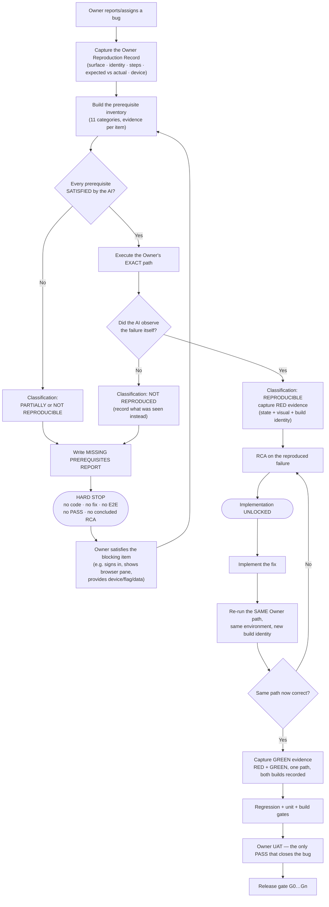

# Bug Reproduction Gate — Workflow

**Binding:** Engineering Constitution Amendment I · **Rationale:** ADR-015 · Applies to Web, Android, iOS.

## The flow

## Gate decision table

| Situation | Classification | Implementation | Report to produce |
|---|---|---|---|
| AI ran the Owner's path and saw the failure | REPRODUCIBLE | **Unlocked** | RED evidence pack |
| Path ran anonymously; the bug needs a signed-in account | PARTIALLY | **Blocked** | Missing Prerequisites |
| Failure emulated (mock/injection/synthetic input) | PARTIALLY | **Blocked** | Missing Prerequisites |
| Only state observed; symptom is visual | PARTIALLY | **Blocked** | Missing Prerequisites |
| Surface/build the Owner used is unproven | PARTIALLY | **Blocked** | Missing Prerequisites |
| Path cannot run at all (no device, no permission, no data) | NOT REPRODUCIBLE | **Blocked** | Missing Prerequisites |
| AI ran the exact path and it worked correctly | NOT REPRODUCED | **Blocked** | Missing Prerequisites + divergence note |
| Owner issued a written waiver | NOT REPRODUCIBLE (waived) | Speculative only, `UNVERIFIED` | Waiver record; PASS still forbidden |

## Evidence pack — required fields

Both RED and GREEN captures must carry the **Runtime Identity Block** (Article II §1 — all seven items proven, or PASS is forbidden) plus:

| Field | Example |
|---|---|
| Repository · Branch · Worktree | `git@github…` · `claude/nifty-sammet-44374f` · absolute path |
| Commit SHA (HEAD) | full 40-char SHA |
| **Build provenance** | the commit the running build was produced from — **not automatically HEAD** (Article II §3) |
| PID · start time · command line | `14276` · `2026-07-29 08:54:20` · `next start <path> -p 3000` |
| Port (proven to belong to that PID) | `3000` via port→PID mapping |
| Build ID on disk **and served over HTTP** | `KXYE_…` · chunk fetched → `HTTP 200` (Article II §2) |
| Surface | `http://localhost:3000/reviews` · `www.tappyai.com` · device model + OS |
| Identity | signed-in `uid=…` / anonymous — stated, never assumed |
| Exact steps | numbered, verbatim from the Owner Reproduction Record |
| Machine state | the app's own state dump (e.g. `__exploreSession.getState()`) |
| Visual | screenshot/recording for any user-visible symptom |
| Console + network | errors, relevant request counts |
| Timestamp | ISO, both captures |

## Standing vocabulary — two axes (Article IV §4)

**Classification** (before work): `REPRODUCIBLE` · `PARTIALLY REPRODUCIBLE` · `NOT REPRODUCIBLE`.

**Verdict** (after execution):
`PASS` — RED+GREEN on the Owner's exact path (Article I §6) **and** an equivalent execution path (Article IV §3).
`PARTIALLY VERIFIED` — executed, but ≥1 material execution-path difference or a substituted prerequisite. *Supersedes the old shorthand `PARTIAL`.* Cannot close a bug, satisfy G0, or support release.
`BLOCKED` — could not execute; prerequisite missing.
`UNVERIFIED` — hypothesis, reasoning, or assumption only (Article V).
`FAIL` — executed and still failing.
**Product UAT: WAITING FOR PRODUCT OWNER** — the closing verdict is always the Owner's.

Every verification report must also publish the **Execution Path Equivalence Matrix** (Article IV §5) and the **Assumption Register** (Article V §4).
